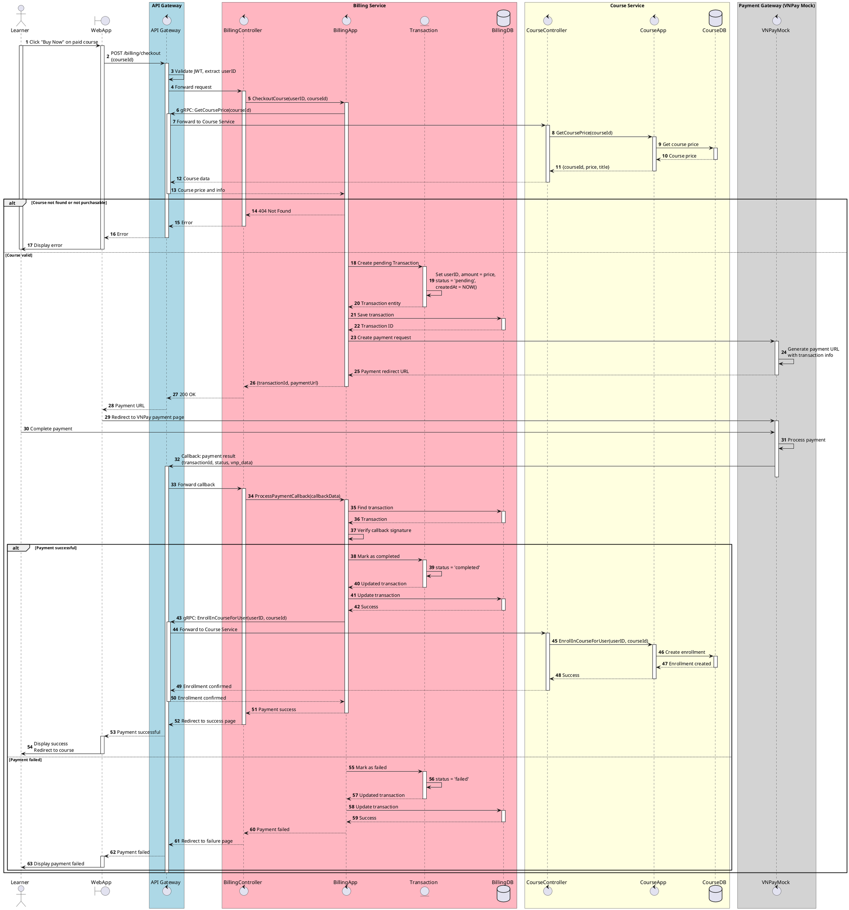

# Sequence CheckoutCourse

:::info
Thực hiện thanh toán qua cổng Mock VNPay.
Flow này thể hiện communication giữa Billing Service và Course Service.
:::

<!-- diagram id="sequence-egolia-billing-checkout-course" -->
