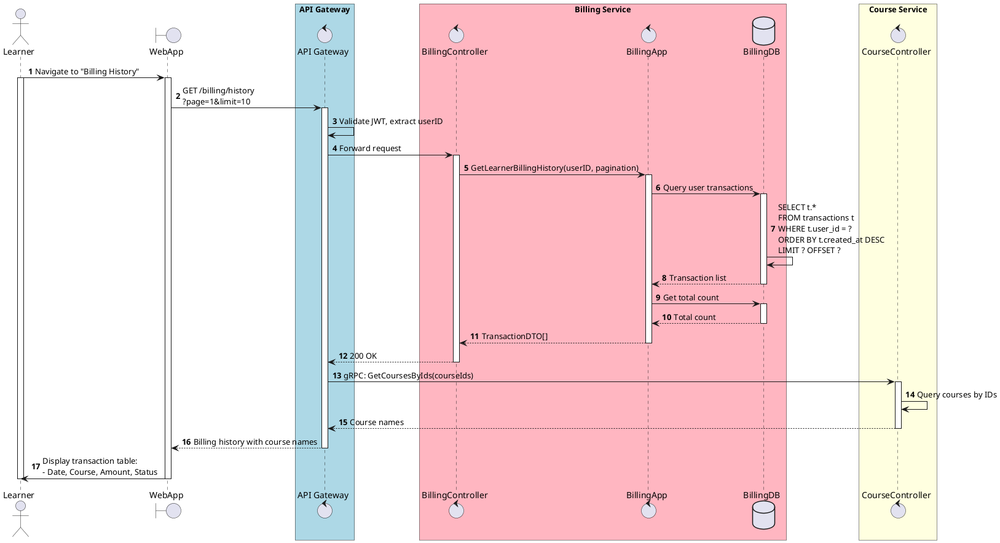

# Sequence GetLearnerBillingHistory

:::info
Learner xem lịch sử giao dịch cá nhân.
:::

```plantuml
@startuml
autonumber

skinparam BoxPadding 10

actor Learner as L
boundary WebApp as WA

box "API Gateway" #LightBlue
  control "API Gateway" as GW
end box

box "Billing Service" #LightPink
  control BillingController as BC
  control BillingApp as BA
  database BillingDB as BDB
end box

box "Course Service" #LightYellow
  control CourseController as CC
end box

L -> WA: Navigate to "Billing History"
activate L
activate WA

WA -> GW: GET /billing/history\n?page=1&limit=10
activate GW
GW -> GW: Validate JWT, extract userID
GW -> BC: Forward request
activate BC

BC -> BA: GetLearnerBillingHistory(userID, pagination)
activate BA

BA -> BDB: Query user transactions
activate BDB
BDB -> BDB: SELECT t.*\nFROM transactions t\nWHERE t.user_id = ?\nORDER BY t.created_at DESC\nLIMIT ? OFFSET ?
BA <-- BDB: Transaction list
deactivate BDB

BA -> BDB: Get total count
activate BDB
BA <-- BDB: Total count
deactivate BDB

BC <-- BA: TransactionDTO[]
deactivate BA
GW <-- BC: 200 OK
deactivate BC

GW -> CC: gRPC: GetCoursesByIds(courseIds)
activate CC
CC -> CC: Query courses by IDs
GW <-- CC: Course names
deactivate CC

WA <-- GW: Billing history with course names
deactivate GW

WA -> L: Display transaction table:\n- Date, Course, Amount, Status
deactivate WA
deactivate L

@enduml
```

<!-- diagram id="sequence-egolia-billing-get-learner-history" -->
