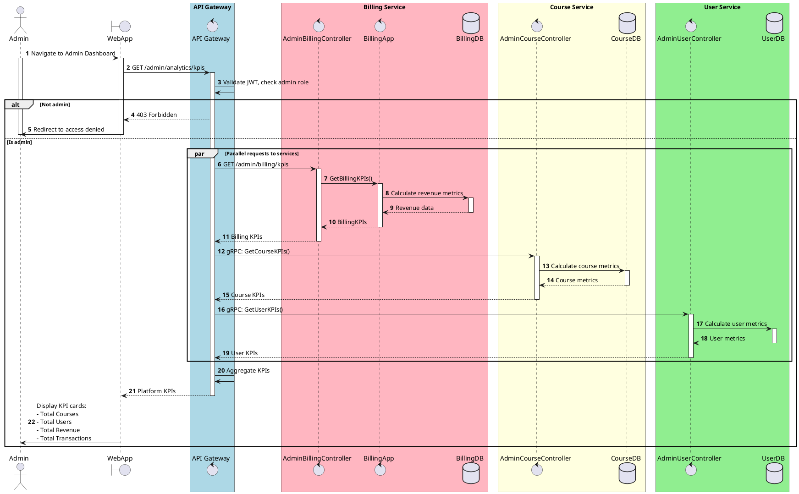

# Sequence GetPlatformHeadlineKpis

:::info
Admin lấy các chỉ số tổng quan: Tổng khóa học, tổng user, tổng doanh thu.
:::

```plantuml
@startuml
autonumber

skinparam BoxPadding 10

actor Admin as A
boundary WebApp as WA

box "API Gateway" #LightBlue
  control "API Gateway" as GW
end box

box "Billing Service" #LightPink
  control AdminBillingController as ABC
  control BillingApp as BA
  database BillingDB as BDB
end box

box "Course Service" #LightYellow
  control AdminCourseController as ACC
  database CourseDB as CDB
end box

box "User Service" #LightGreen
  control AdminUserController as AUC
  database UserDB as UDB
end box

A -> WA: Navigate to Admin Dashboard
activate A
activate WA

WA -> GW: GET /admin/analytics/kpis
activate GW
GW -> GW: Validate JWT, check admin role

alt Not admin
  WA <-- GW: 403 Forbidden
  WA -> A: Redirect to access denied
  deactivate WA
  deactivate A
else Is admin
  par Parallel requests to services
    GW -> ABC: GET /admin/billing/kpis
    activate ABC
    ABC -> BA: GetBillingKPIs()
    activate BA
    BA -> BDB: Calculate revenue metrics
    activate BDB
    BA <-- BDB: Revenue data
    deactivate BDB
    ABC <-- BA: BillingKPIs
    deactivate BA
    GW <-- ABC: Billing KPIs
    deactivate ABC

    GW -> ACC: gRPC: GetCourseKPIs()
    activate ACC
    ACC -> CDB: Calculate course metrics
    activate CDB
    ACC <-- CDB: Course metrics
    deactivate CDB
    GW <-- ACC: Course KPIs
    deactivate ACC

    GW -> AUC: gRPC: GetUserKPIs()
    activate AUC
    AUC -> UDB: Calculate user metrics
    activate UDB
    AUC <-- UDB: User metrics
    deactivate UDB
    GW <-- AUC: User KPIs
    deactivate AUC
  end

  GW -> GW: Aggregate KPIs

  WA <-- GW: Platform KPIs
  deactivate GW

  WA -> A: Display KPI cards:\n- Total Courses\n- Total Users\n- Total Revenue\n- Total Transactions
  deactivate WA
  deactivate A
end

@enduml
```

<!-- diagram id="sequence-egolia-billing-get-headline-kpis" -->
