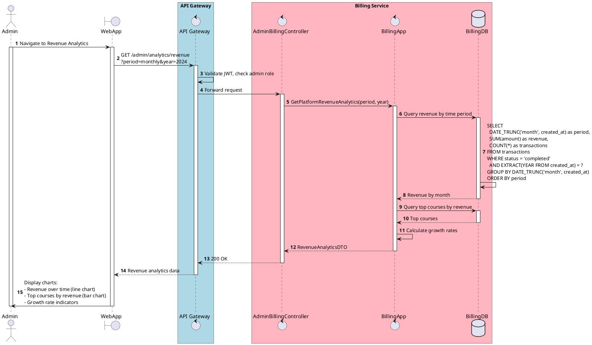

# Sequence GetPlatformRevenueAnalytics

:::info
Admin xem biểu đồ phân tích doanh thu.
:::

```plantuml
@startuml
autonumber

skinparam BoxPadding 10

actor Admin as A
boundary WebApp as WA

box "API Gateway" #LightBlue
  control "API Gateway" as GW
end box

box "Billing Service" #LightPink
  control AdminBillingController as ABC
  control BillingApp as BA
  database BillingDB as BDB
end box

A -> WA: Navigate to Revenue Analytics
activate A
activate WA

WA -> GW: GET /admin/analytics/revenue\n?period=monthly&year=2024
activate GW
GW -> GW: Validate JWT, check admin role
GW -> ABC: Forward request
activate ABC

ABC -> BA: GetPlatformRevenueAnalytics(period, year)
activate BA

BA -> BDB: Query revenue by time period
activate BDB
BDB -> BDB: SELECT \n  DATE_TRUNC('month', created_at) as period,\n  SUM(amount) as revenue,\n  COUNT(*) as transactions\nFROM transactions\nWHERE status = 'completed'\n  AND EXTRACT(YEAR FROM created_at) = ?\nGROUP BY DATE_TRUNC('month', created_at)\nORDER BY period
BA <-- BDB: Revenue by month
deactivate BDB

BA -> BDB: Query top courses by revenue
activate BDB
BA <-- BDB: Top courses
deactivate BDB

BA -> BA: Calculate growth rates

ABC <-- BA: RevenueAnalyticsDTO
deactivate BA
GW <-- ABC: 200 OK
deactivate ABC
WA <-- GW: Revenue analytics data
deactivate GW

WA -> A: Display charts:\n- Revenue over time (line chart)\n- Top courses by revenue (bar chart)\n- Growth rate indicators
deactivate WA
deactivate A

@enduml
```

<!-- diagram id="sequence-egolia-billing-get-revenue-analytics" -->
