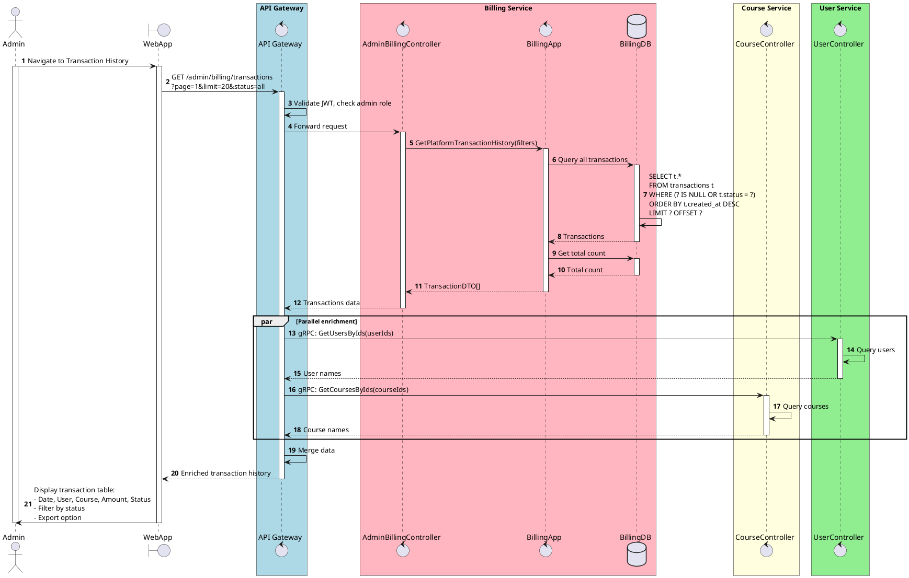

# Sequence GetPlatformTransactionHistory

:::info
Admin xem toàn bộ lịch sử thanh toán trên hệ thống.
:::

```plantuml
@startuml
autonumber

skinparam BoxPadding 10

actor Admin as A
boundary WebApp as WA

box "API Gateway" #LightBlue
  control "API Gateway" as GW
end box

box "Billing Service" #LightPink
  control AdminBillingController as ABC
  control BillingApp as BA
  database BillingDB as BDB
end box

box "Course Service" #LightYellow
  control CourseController as CC
end box

box "User Service" #LightGreen
  control UserController as UC
end box

A -> WA: Navigate to Transaction History
activate A
activate WA

WA -> GW: GET /admin/billing/transactions\n?page=1&limit=20&status=all
activate GW
GW -> GW: Validate JWT, check admin role
GW -> ABC: Forward request
activate ABC

ABC -> BA: GetPlatformTransactionHistory(filters)
activate BA

BA -> BDB: Query all transactions
activate BDB
BDB -> BDB: SELECT t.*\nFROM transactions t\nWHERE (? IS NULL OR t.status = ?)\nORDER BY t.created_at DESC\nLIMIT ? OFFSET ?
BA <-- BDB: Transactions
deactivate BDB

BA -> BDB: Get total count
activate BDB
BA <-- BDB: Total count
deactivate BDB

ABC <-- BA: TransactionDTO[]
deactivate BA
GW <-- ABC: Transactions data
deactivate ABC

par Parallel enrichment
  GW -> UC: gRPC: GetUsersByIds(userIds)
  activate UC
  UC -> UC: Query users
  GW <-- UC: User names
  deactivate UC

  GW -> CC: gRPC: GetCoursesByIds(courseIds)
  activate CC
  CC -> CC: Query courses
  GW <-- CC: Course names
  deactivate CC
end

GW -> GW: Merge data

WA <-- GW: Enriched transaction history
deactivate GW

WA -> A: Display transaction table:\n- Date, User, Course, Amount, Status\n- Filter by status\n- Export option
deactivate WA
deactivate A

@enduml
```

<!-- diagram id="sequence-egolia-billing-get-transaction-history" -->
