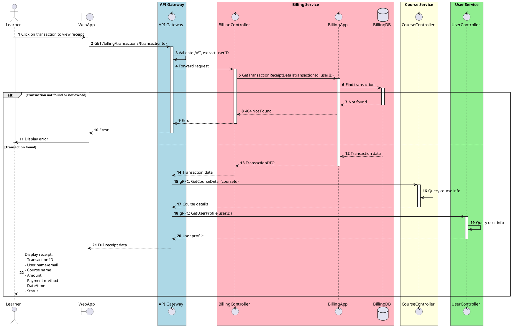

# Sequence GetTransactionReceiptDetail

:::info
Truy xuất chi tiết biên lai giao dịch.
:::

```plantuml
@startuml
autonumber

skinparam BoxPadding 10

actor Learner as L
boundary WebApp as WA

box "API Gateway" #LightBlue
  control "API Gateway" as GW
end box

box "Billing Service" #LightPink
  control BillingController as BC
  control BillingApp as BA
  database BillingDB as BDB
end box

box "Course Service" #LightYellow
  control CourseController as CC
end box

box "User Service" #LightGreen
  control UserController as UC
end box

L -> WA: Click on transaction to view receipt
activate L
activate WA

WA -> GW: GET /billing/transactions/{transactionId}
activate GW
GW -> GW: Validate JWT, extract userID
GW -> BC: Forward request
activate BC

BC -> BA: GetTransactionReceiptDetail(transactionId, userID)
activate BA

BA -> BDB: Find transaction
activate BDB

alt Transaction not found or not owned
  BA <-- BDB: Not found
  deactivate BDB
  BC <-- BA: 404 Not Found
  GW <-- BC: Error
  deactivate BC
  WA <-- GW: Error
  deactivate GW
  WA -> L: Display error
  deactivate WA
  deactivate L
else Transaction found
  BA <-- BDB: Transaction data
  deactivate BDB

  BC <-- BA: TransactionDTO
  deactivate BA
  GW <-- BC: Transaction data
  deactivate BC

  GW -> CC: gRPC: GetCourseDetail(courseId)
  activate CC
  CC -> CC: Query course info
  GW <-- CC: Course details
  deactivate CC

  GW -> UC: gRPC: GetUserProfile(userID)
  activate UC
  UC -> UC: Query user info
  GW <-- UC: User profile
  deactivate UC

  WA <-- GW: Full receipt data
  deactivate GW

  WA -> L: Display receipt:\n- Transaction ID\n- User name/email\n- Course name\n- Amount\n- Payment method\n- Date/time\n- Status
  deactivate WA
  deactivate L
end

@enduml
```

<!-- diagram id="sequence-egolia-billing-get-receipt-detail" -->
