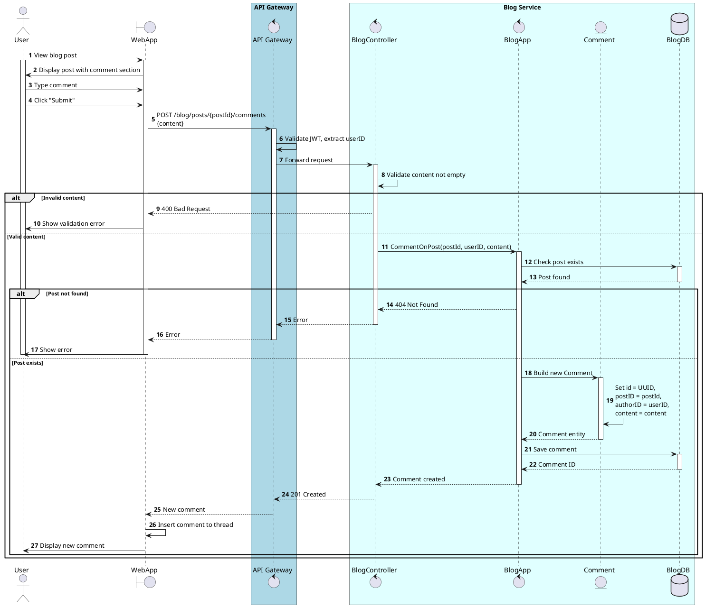

# Sequence CommentOnPost

:::info
User comment trực tiếp vào bài viết.
:::

```plantuml
@startuml
autonumber

skinparam BoxPadding 10

actor User as U
boundary WebApp as WA

box "API Gateway" #LightBlue
  control "API Gateway" as GW
end box

box "Blog Service" #LightCyan
  control BlogController as BC
  control BlogApp as BA
  entity Comment as C
  database BlogDB as BDB
end box

U -> WA: View blog post
activate U
activate WA
WA -> U: Display post with comment section
U -> WA: Type comment
U -> WA: Click "Submit"

WA -> GW: POST /blog/posts/{postId}/comments\n{content}
activate GW
GW -> GW: Validate JWT, extract userID
GW -> BC: Forward request
activate BC

BC -> BC: Validate content not empty

alt Invalid content
  WA <-- BC: 400 Bad Request
  WA -> U: Show validation error
else Valid content
  BC -> BA: CommentOnPost(postId, userID, content)
  activate BA

  BA -> BDB: Check post exists
  activate BDB
  BA <-- BDB: Post found
  deactivate BDB

  alt Post not found
    BC <-- BA: 404 Not Found
    GW <-- BC: Error
    deactivate BC
    WA <-- GW: Error
    deactivate GW
    WA -> U: Show error
    deactivate WA
    deactivate U
  else Post exists
    BA -> C: Build new Comment
    activate C
    C -> C: Set id = UUID,\npostID = postId,\nauthorID = userID,\ncontent = content
    BA <-- C: Comment entity
    deactivate C

    BA -> BDB: Save comment
    activate BDB
    BA <-- BDB: Comment ID
    deactivate BDB

    BC <-- BA: Comment created
    deactivate BA
    GW <-- BC: 201 Created
    deactivate BC
    WA <-- GW: New comment
    deactivate GW

    WA -> WA: Insert comment to thread
    WA -> U: Display new comment
    deactivate WA
    deactivate U
  end
end

@enduml
```

<!-- diagram id="sequence-egolia-blog-comment-on-post" -->
