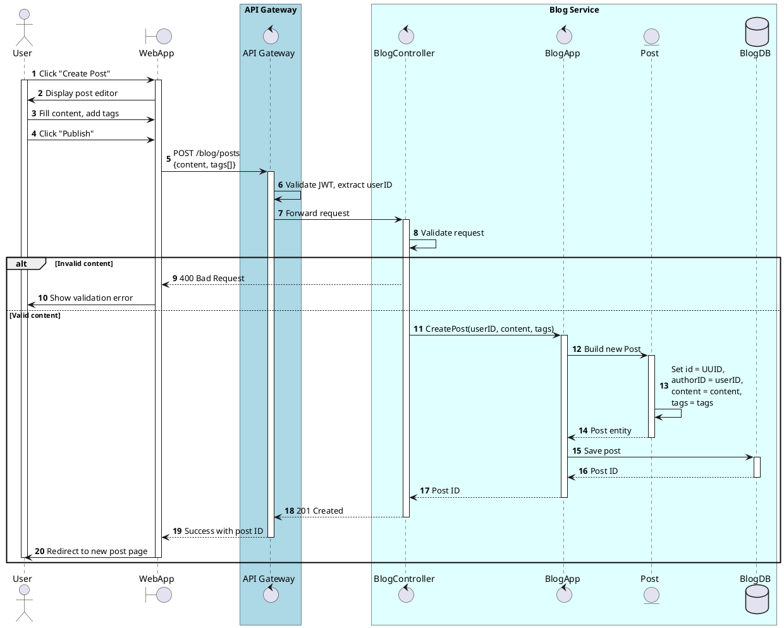

# Sequence CreatePost

:::info
User tạo bài viết mới trên blog.
:::

```plantuml
@startuml
autonumber

skinparam BoxPadding 10

actor User as U
boundary WebApp as WA

box "API Gateway" #LightBlue
  control "API Gateway" as GW
end box

box "Blog Service" #LightCyan
  control BlogController as BC
  control BlogApp as BA
  entity Post as P
  database BlogDB as BDB
end box

U -> WA: Click "Create Post"
activate U
activate WA

WA -> U: Display post editor
U -> WA: Fill content, add tags
U -> WA: Click "Publish"

WA -> GW: POST /blog/posts\n{content, tags[]}
activate GW
GW -> GW: Validate JWT, extract userID
GW -> BC: Forward request
activate BC

BC -> BC: Validate request

alt Invalid content
  WA <-- BC: 400 Bad Request
  WA -> U: Show validation error
else Valid content
  BC -> BA: CreatePost(userID, content, tags)
  activate BA

  BA -> P: Build new Post
  activate P
  P -> P: Set id = UUID,\nauthorID = userID,\ncontent = content,\ntags = tags
  BA <-- P: Post entity
  deactivate P

  BA -> BDB: Save post
  activate BDB
  BA <-- BDB: Post ID
  deactivate BDB

  BC <-- BA: Post ID
  deactivate BA
  GW <-- BC: 201 Created
  deactivate BC
  WA <-- GW: Success with post ID
  deactivate GW

  WA -> U: Redirect to new post page
  deactivate WA
  deactivate U
end

@enduml
```

<!-- diagram id="sequence-egolia-blog-create-post" -->
