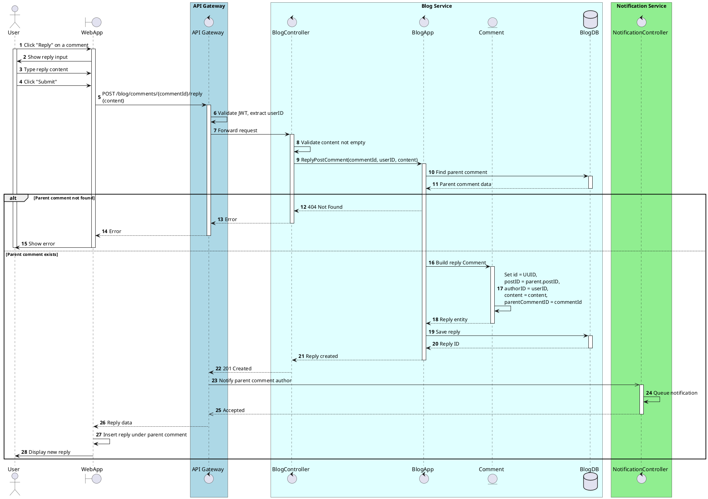

# Sequence ReplyPostComment

:::info
User trả lời một comment trong bài viết.
:::

```plantuml
@startuml
autonumber

skinparam BoxPadding 10

actor User as U
boundary WebApp as WA

box "API Gateway" #LightBlue
  control "API Gateway" as GW
end box

box "Blog Service" #LightCyan
  control BlogController as BC
  control BlogApp as BA
  entity Comment as C
  database BlogDB as BDB
end box

box "Notification Service" #LightGreen
  control NotificationController as NC
end box

U -> WA: Click "Reply" on a comment
activate U
activate WA
WA -> U: Show reply input
U -> WA: Type reply content
U -> WA: Click "Submit"

WA -> GW: POST /blog/comments/{commentId}/reply\n{content}
activate GW
GW -> GW: Validate JWT, extract userID
GW -> BC: Forward request
activate BC

BC -> BC: Validate content not empty
BC -> BA: ReplyPostComment(commentId, userID, content)
activate BA

BA -> BDB: Find parent comment
activate BDB
BA <-- BDB: Parent comment data
deactivate BDB

alt Parent comment not found
  BC <-- BA: 404 Not Found
  GW <-- BC: Error
  deactivate BC
  WA <-- GW: Error
  deactivate GW
  WA -> U: Show error
  deactivate WA
  deactivate U
else Parent comment exists
  BA -> C: Build reply Comment
  activate C
  C -> C: Set id = UUID,\npostID = parent.postID,\nauthorID = userID,\ncontent = content,\nparentCommentID = commentId
  BA <-- C: Reply entity
  deactivate C

  BA -> BDB: Save reply
  activate BDB
  BA <-- BDB: Reply ID
  deactivate BDB

  BC <-- BA: Reply created
  deactivate BA
  GW <-- BC: 201 Created
  deactivate BC

  GW ->> NC: Notify parent comment author
  activate NC
  NC -> NC: Queue notification
  GW <<-- NC: Accepted
  deactivate NC

  WA <-- GW: Reply data
  deactivate GW

  WA -> WA: Insert reply under parent comment
  WA -> U: Display new reply
  deactivate WA
  deactivate U
end

@enduml
```

<!-- diagram id="sequence-egolia-blog-reply-post-comment" -->
