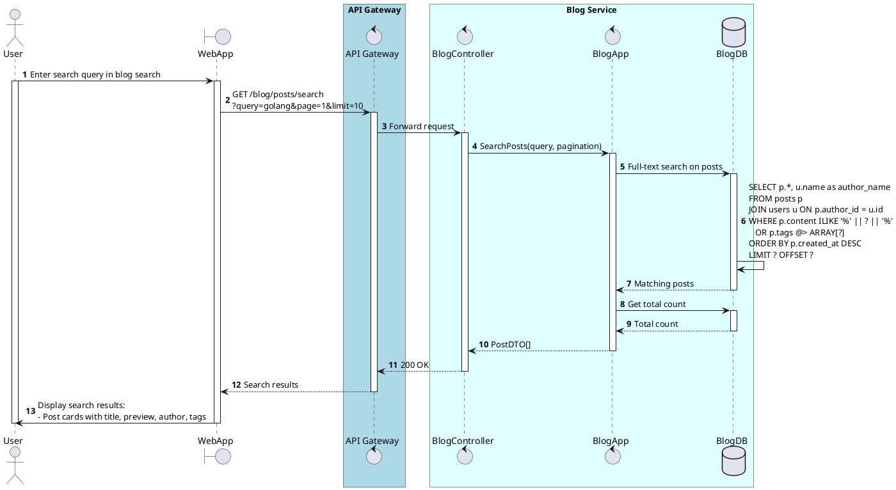

# Sequence SearchBlog

:::info
Tìm kiếm bài viết theo từ khóa.
:::

```plantuml
@startuml
autonumber

skinparam BoxPadding 10

actor User as U
boundary WebApp as WA

box "API Gateway" #LightBlue
  control "API Gateway" as GW
end box

box "Blog Service" #LightCyan
  control BlogController as BC
  control BlogApp as BA
  database BlogDB as BDB
end box

U -> WA: Enter search query in blog search
activate U
activate WA

WA -> GW: GET /blog/posts/search\n?query=golang&page=1&limit=10
activate GW
GW -> BC: Forward request
activate BC

BC -> BA: SearchPosts(query, pagination)
activate BA

BA -> BDB: Full-text search on posts
activate BDB
BDB -> BDB: SELECT p.*, u.name as author_name\nFROM posts p\nJOIN users u ON p.author_id = u.id\nWHERE p.content ILIKE '%' || ? || '%'\n   OR p.tags @> ARRAY[?]\nORDER BY p.created_at DESC\nLIMIT ? OFFSET ?
BA <-- BDB: Matching posts
deactivate BDB

BA -> BDB: Get total count
activate BDB
BA <-- BDB: Total count
deactivate BDB

BC <-- BA: PostDTO[]
deactivate BA
GW <-- BC: 200 OK
deactivate BC
WA <-- GW: Search results
deactivate GW

WA -> U: Display search results:\n- Post cards with title, preview, author, tags
deactivate WA
deactivate U

@enduml
```

<!-- diagram id="sequence-egolia-blog-search-blog" -->
