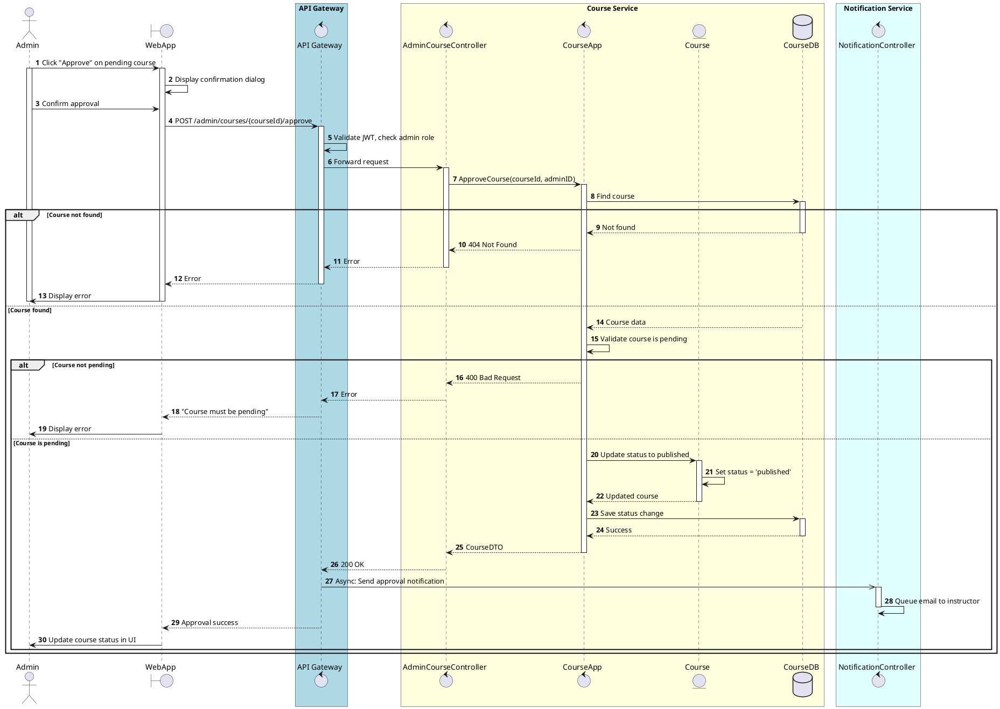

# Sequence ApproveCourse

:::info
Admin phê duyệt một khóa học (từ Pending sang Published).
:::

```plantuml
@startuml
autonumber

skinparam BoxPadding 10

actor Admin as A
boundary WebApp as WA

box "API Gateway" #LightBlue
  control "API Gateway" as GW
end box

box "Course Service" #LightYellow
  control AdminCourseController as ACC
  control CourseApp as CA
  entity Course as C
  database CourseDB as CDB
end box

box "Notification Service" #LightCyan
  control NotificationController as NC
end box

A -> WA: Click "Approve" on pending course
activate A
activate WA
WA -> WA: Display confirmation dialog

A -> WA: Confirm approval

WA -> GW: POST /admin/courses/{courseId}/approve
activate GW
GW -> GW: Validate JWT, check admin role
GW -> ACC: Forward request
activate ACC

ACC -> CA: ApproveCourse(courseId, adminID)
activate CA

CA -> CDB: Find course
activate CDB

alt Course not found
  CA <-- CDB: Not found
  deactivate CDB
  ACC <-- CA: 404 Not Found
  GW <-- ACC: Error
  deactivate ACC
  WA <-- GW: Error
  deactivate GW
  WA -> A: Display error
  deactivate WA
  deactivate A
else Course found
  CA <-- CDB: Course data
  deactivate CDB

  CA -> CA: Validate course is pending

  alt Course not pending
    ACC <-- CA: 400 Bad Request
    GW <-- ACC: Error
    deactivate ACC
    WA <-- GW: "Course must be pending"
    deactivate GW
    WA -> A: Display error
    deactivate WA
    deactivate A
  else Course is pending
    CA -> C: Update status to published
    activate C
    C -> C: Set status = 'published'
    CA <-- C: Updated course
    deactivate C

    CA -> CDB: Save status change
    activate CDB
    CA <-- CDB: Success
    deactivate CDB

    ACC <-- CA: CourseDTO
    deactivate CA
    GW <-- ACC: 200 OK
    deactivate ACC

    GW ->> NC: Async: Send approval notification
    activate NC
    NC -> NC: Queue email to instructor
    deactivate NC

    WA <-- GW: Approval success
    deactivate GW
    WA -> A: Update course status in UI
    deactivate WA
    deactivate A
  end
end

@enduml
```

<!-- diagram id="sequence-egolia-course-approve-course" -->
