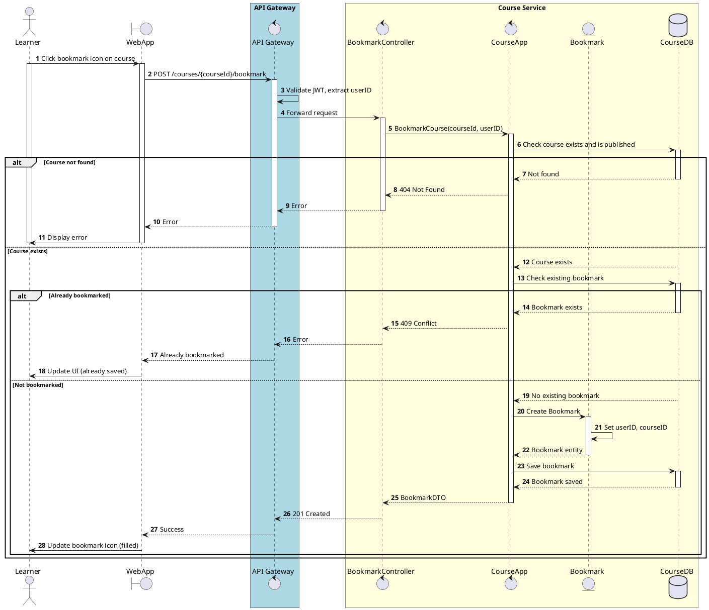

# Sequence BookmarkCourse

:::info
Learner bấm nút lưu khóa học vào danh sách yêu thích để xem sau.
:::

```plantuml
@startuml
autonumber

skinparam BoxPadding 10

actor Learner as L
boundary WebApp as WA

box "API Gateway" #LightBlue
  control "API Gateway" as GW
end box

box "Course Service" #LightYellow
  control BookmarkController as BC
  control CourseApp as CA
  entity Bookmark as B
  database CourseDB as CDB
end box

L -> WA: Click bookmark icon on course
activate L
activate WA

WA -> GW: POST /courses/{courseId}/bookmark
activate GW
GW -> GW: Validate JWT, extract userID
GW -> BC: Forward request
activate BC

BC -> CA: BookmarkCourse(courseId, userID)
activate CA

CA -> CDB: Check course exists and is published
activate CDB

alt Course not found
  CA <-- CDB: Not found
  deactivate CDB
  BC <-- CA: 404 Not Found
  GW <-- BC: Error
  deactivate BC
  WA <-- GW: Error
  deactivate GW
  WA -> L: Display error
  deactivate WA
  deactivate L
else Course exists
  CA <-- CDB: Course exists
  deactivate CDB

  CA -> CDB: Check existing bookmark
  activate CDB

  alt Already bookmarked
    CA <-- CDB: Bookmark exists
    deactivate CDB
    BC <-- CA: 409 Conflict
    GW <-- BC: Error
    deactivate BC
    WA <-- GW: Already bookmarked
    deactivate GW
    WA -> L: Update UI (already saved)
    deactivate WA
    deactivate L
  else Not bookmarked
    CA <-- CDB: No existing bookmark
    deactivate CDB

    CA -> B: Create Bookmark
    activate B
    B -> B: Set userID, courseID
    CA <-- B: Bookmark entity
    deactivate B

    CA -> CDB: Save bookmark
    activate CDB
    CA <-- CDB: Bookmark saved
    deactivate CDB

    BC <-- CA: BookmarkDTO
    deactivate CA
    GW <-- BC: 201 Created
    deactivate BC
    WA <-- GW: Success
    deactivate GW
    WA -> L: Update bookmark icon (filled)
    deactivate WA
    deactivate L
  end
end

@enduml
```

<!-- diagram id="sequence-egolia-course-bookmark-course" -->
