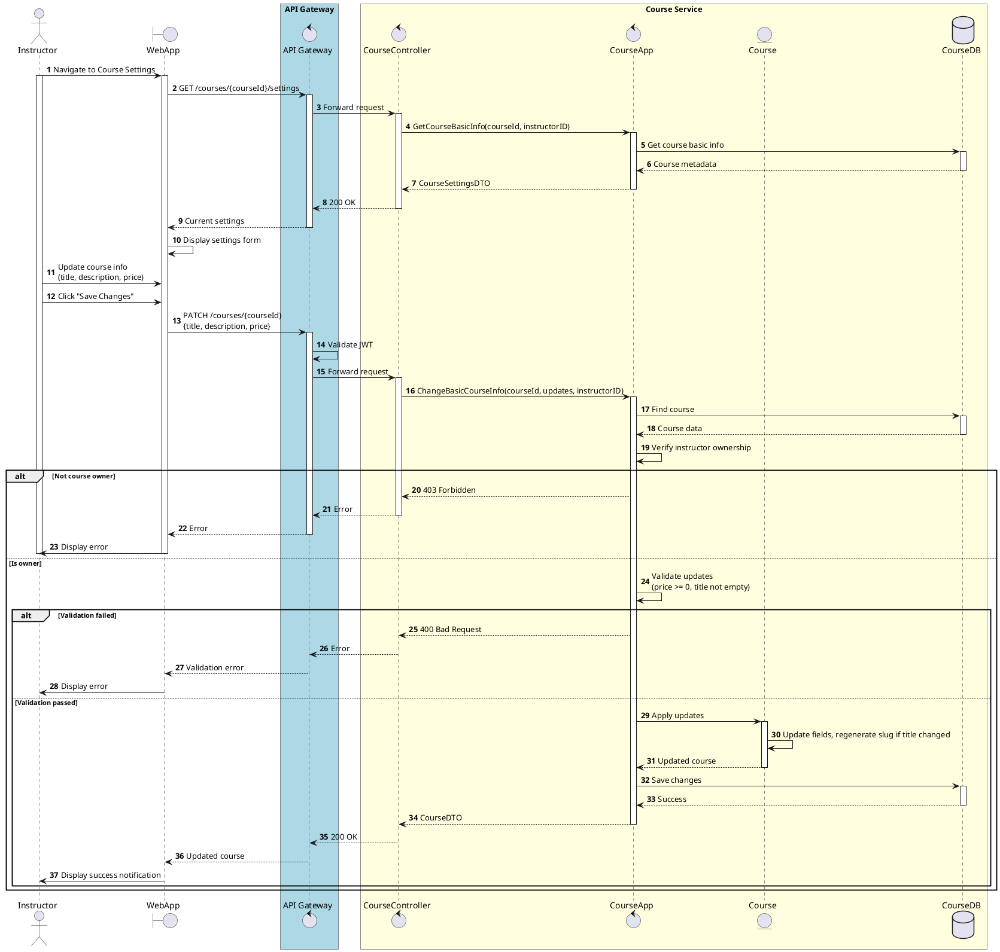

# Sequence ChangeBasicCourseInfo

:::info
Cập nhật siêu dữ liệu cơ bản (tên, tác giả, giá...) mà không cần load toàn bộ nội dung khóa học.
:::

<!-- diagram id="sequence-egolia-course-change-basic-info" -->
