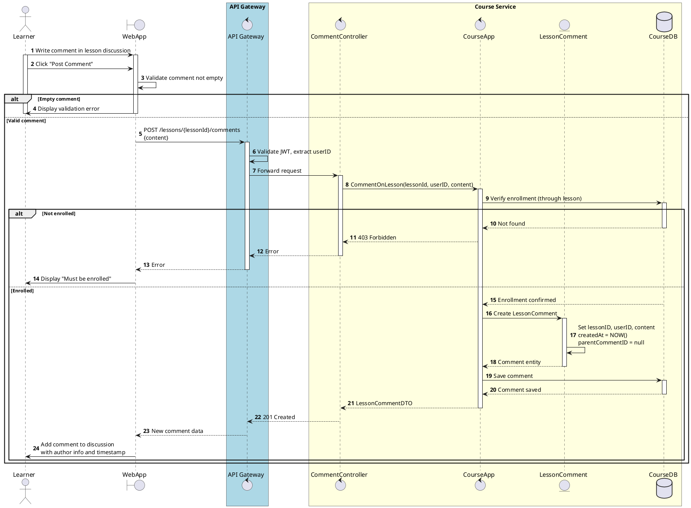

# Sequence CommentOnLesson

:::info
User viết comment vào một bài học, hệ thống lưu và hiển thị ở phần thảo luận.
:::

```plantuml
@startuml
autonumber

skinparam BoxPadding 10

actor Learner as L
boundary WebApp as WA

box "API Gateway" #LightBlue
  control "API Gateway" as GW
end box

box "Course Service" #LightYellow
  control CommentController as CC
  control CourseApp as CA
  entity LessonComment as LC
  database CourseDB as CDB
end box

L -> WA: Write comment in lesson discussion
activate L
activate WA

L -> WA: Click "Post Comment"

WA -> WA: Validate comment not empty

alt Empty comment
  WA -> L: Display validation error
  deactivate WA
  deactivate L
else Valid comment
  WA -> GW: POST /lessons/{lessonId}/comments\n{content}
  activate GW
  GW -> GW: Validate JWT, extract userID
  GW -> CC: Forward request
  activate CC

  CC -> CA: CommentOnLesson(lessonId, userID, content)
  activate CA

  CA -> CDB: Verify enrollment (through lesson)
  activate CDB

  alt Not enrolled
    CA <-- CDB: Not found
    deactivate CDB
    CC <-- CA: 403 Forbidden
    GW <-- CC: Error
    deactivate CC
    WA <-- GW: Error
    deactivate GW
    WA -> L: Display "Must be enrolled"
    deactivate WA
    deactivate L
  else Enrolled
    CA <-- CDB: Enrollment confirmed
    deactivate CDB

    CA -> LC: Create LessonComment
    activate LC
    LC -> LC: Set lessonID, userID, content\ncreatedAt = NOW()\nparentCommentID = null
    CA <-- LC: Comment entity
    deactivate LC

    CA -> CDB: Save comment
    activate CDB
    CA <-- CDB: Comment saved
    deactivate CDB

    CC <-- CA: LessonCommentDTO
    deactivate CA
    GW <-- CC: 201 Created
    deactivate CC
    WA <-- GW: New comment data
    deactivate GW

    WA -> L: Add comment to discussion\nwith author info and timestamp
    deactivate WA
    deactivate L
  end
end

@enduml
```

<!-- diagram id="sequence-egolia-course-comment-on-lesson" -->
