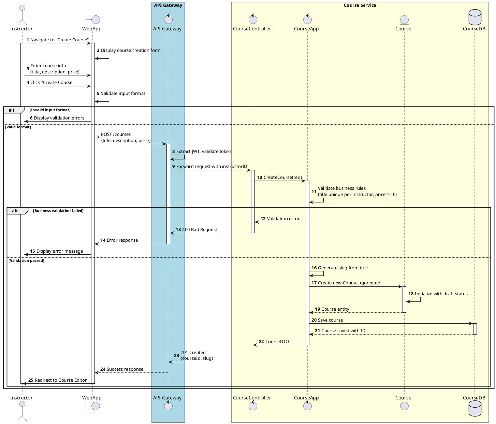

# Sequence CreateCourse

:::info
Instructor khởi tạo một khóa học mới với các thông tin cơ bản.
:::

```plantuml
@startuml
autonumber

skinparam BoxPadding 10

actor Instructor as I
boundary WebApp as WA

box "API Gateway" #LightBlue
  control "API Gateway" as GW
end box

box "Course Service" #LightYellow
  control CourseController as CC
  control CourseApp as CA
  entity Course as C
  database CourseDB as CDB
end box

I -> WA: Navigate to "Create Course"
activate I
activate WA
WA -> WA: Display course creation form

I -> WA: Enter course info\n(title, description, price)
I -> WA: Click "Create Course"

WA -> WA: Validate input format

alt Invalid input format
  WA -> I: Display validation errors
else Valid format
  WA -> GW: POST /courses\n{title, description, price}
  activate GW
  GW -> GW: Extract JWT, validate token
  GW -> CC: Forward request with instructorID
  activate CC

  CC -> CA: CreateCourse(req)
  activate CA
  CA -> CA: Validate business rules\n(title unique per instructor, price >= 0)

  alt Business validation failed
    CC <-- CA: Validation error
    GW <-- CC: 400 Bad Request
    deactivate CC
    WA <-- GW: Error response
    deactivate GW
    WA -> I: Display error message
  else Validation passed
    CA -> CA: Generate slug from title
    CA -> C: Create new Course aggregate
    activate C
    C -> C: Initialize with draft status
    CA <-- C: Course entity
    deactivate C

    CA -> CDB: Save course
    activate CDB
    CA <-- CDB: Course saved with ID
    deactivate CDB

    CC <-- CA: CourseDTO
    deactivate CA
    GW <-- CC: 201 Created\n{courseId, slug}
    deactivate CC
    WA <-- GW: Success response
    deactivate GW
    WA -> I: Redirect to Course Editor
    deactivate WA
    deactivate I
  end
end

@enduml
```

<!-- diagram id="sequence-egolia-course-create-course" -->
