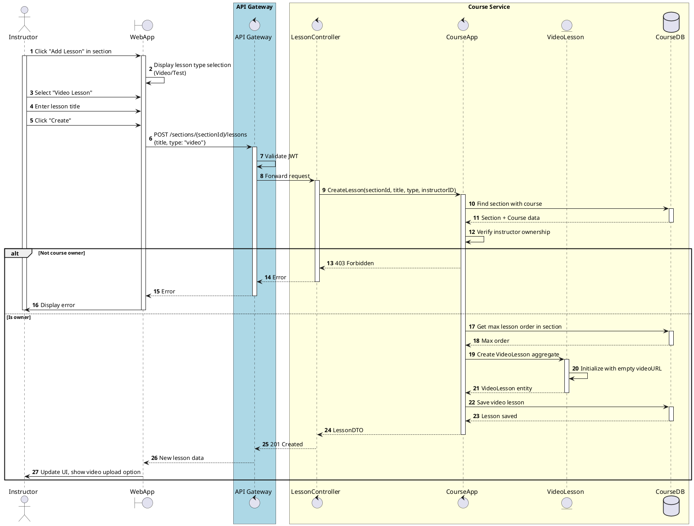

# Sequence CreateLesson

:::info
Instructor tạo bài học mới (Video/Text) và thêm vào một chương cụ thể.
:::

```plantuml
@startuml
autonumber

skinparam BoxPadding 10

actor Instructor as I
boundary WebApp as WA

box "API Gateway" #LightBlue
  control "API Gateway" as GW
end box

box "Course Service" #LightYellow
  control LessonController as LC
  control CourseApp as CA
  entity VideoLesson as VL
  database CourseDB as CDB
end box

I -> WA: Click "Add Lesson" in section
activate I
activate WA
WA -> WA: Display lesson type selection\n(Video/Test)

I -> WA: Select "Video Lesson"
I -> WA: Enter lesson title
I -> WA: Click "Create"

WA -> GW: POST /sections/{sectionId}/lessons\n{title, type: "video"}
activate GW
GW -> GW: Validate JWT
GW -> LC: Forward request
activate LC

LC -> CA: CreateLesson(sectionId, title, type, instructorID)
activate CA

CA -> CDB: Find section with course
activate CDB
CA <-- CDB: Section + Course data
deactivate CDB

CA -> CA: Verify instructor ownership

alt Not course owner
  LC <-- CA: 403 Forbidden
  GW <-- LC: Error
  deactivate LC
  WA <-- GW: Error
  deactivate GW
  WA -> I: Display error
  deactivate WA
  deactivate I
else Is owner
  CA -> CDB: Get max lesson order in section
  activate CDB
  CA <-- CDB: Max order
  deactivate CDB

  CA -> VL: Create VideoLesson aggregate
  activate VL
  VL -> VL: Initialize with empty videoURL
  CA <-- VL: VideoLesson entity
  deactivate VL

  CA -> CDB: Save video lesson
  activate CDB
  CA <-- CDB: Lesson saved
  deactivate CDB

  LC <-- CA: LessonDTO
  deactivate CA
  GW <-- LC: 201 Created
  deactivate LC
  WA <-- GW: New lesson data
  deactivate GW
  WA -> I: Update UI, show video upload option
  deactivate WA
  deactivate I
end

@enduml
```

<!-- diagram id="sequence-egolia-course-create-lesson" -->
