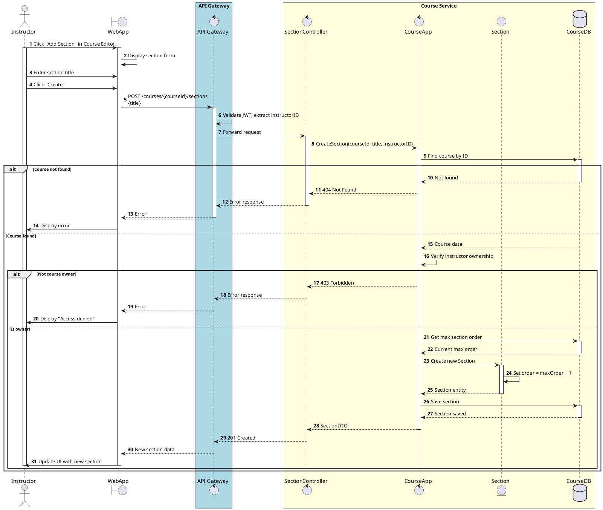

# Sequence CreateSection

:::info
Instructor thêm chương mới để gom nhóm các bài giảng, bài kiểm tra.
:::

```plantuml
@startuml
autonumber

skinparam BoxPadding 10

actor Instructor as I
boundary WebApp as WA

box "API Gateway" #LightBlue
  control "API Gateway" as GW
end box

box "Course Service" #LightYellow
  control SectionController as SC
  control CourseApp as CA
  entity Section as S
  database CourseDB as CDB
end box

I -> WA: Click "Add Section" in Course Editor
activate I
activate WA
WA -> WA: Display section form

I -> WA: Enter section title
I -> WA: Click "Create"

WA -> GW: POST /courses/{courseId}/sections\n{title}
activate GW
GW -> GW: Validate JWT, extract instructorID
GW -> SC: Forward request
activate SC

SC -> CA: CreateSection(courseId, title, instructorID)
activate CA

CA -> CDB: Find course by ID
activate CDB

alt Course not found
  CA <-- CDB: Not found
  deactivate CDB
  SC <-- CA: 404 Not Found
  GW <-- SC: Error response
  deactivate SC
  WA <-- GW: Error
  deactivate GW
  WA -> I: Display error
else Course found
  CA <-- CDB: Course data
  deactivate CDB

  CA -> CA: Verify instructor ownership

  alt Not course owner
    SC <-- CA: 403 Forbidden
    GW <-- SC: Error response
    deactivate SC
    WA <-- GW: Error
    deactivate GW
    WA -> I: Display "Access denied"
  else Is owner
    CA -> CDB: Get max section order
    activate CDB
    CA <-- CDB: Current max order
    deactivate CDB

    CA -> S: Create new Section
    activate S
    S -> S: Set order = maxOrder + 1
    CA <-- S: Section entity
    deactivate S

    CA -> CDB: Save section
    activate CDB
    CA <-- CDB: Section saved
    deactivate CDB

    SC <-- CA: SectionDTO
    deactivate CA
    GW <-- SC: 201 Created
    deactivate SC
    WA <-- GW: New section data
    deactivate GW
    WA -> I: Update UI with new section
    deactivate WA
    deactivate I
  end
end

@enduml
```

<!-- diagram id="sequence-egolia-course-create-section" -->
