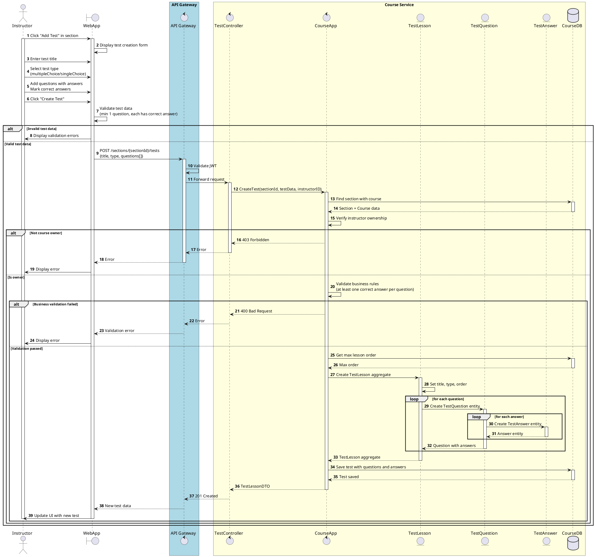

# Sequence CreateTest

:::info
Instructor tạo một bài kiểm tra trắc nghiệm ở cuối chương.
:::

```plantuml
@startuml
autonumber

skinparam BoxPadding 10

actor Instructor as I
boundary WebApp as WA

box "API Gateway" #LightBlue
  control "API Gateway" as GW
end box

box "Course Service" #LightYellow
  control TestController as TC
  control CourseApp as CA
  entity TestLesson as TL
  entity TestQuestion as TQ
  entity TestAnswer as TA
  database CourseDB as CDB
end box

I -> WA: Click "Add Test" in section
activate I
activate WA
WA -> WA: Display test creation form

I -> WA: Enter test title
I -> WA: Select test type\n(multipleChoice/singleChoice)
I -> WA: Add questions with answers\nMark correct answers
I -> WA: Click "Create Test"

WA -> WA: Validate test data\n(min 1 question, each has correct answer)

alt Invalid test data
  WA -> I: Display validation errors
else Valid test data
  WA -> GW: POST /sections/{sectionId}/tests\n{title, type, questions[]}
  activate GW
  GW -> GW: Validate JWT
  GW -> TC: Forward request
  activate TC

  TC -> CA: CreateTest(sectionId, testData, instructorID)
  activate CA

  CA -> CDB: Find section with course
  activate CDB
  CA <-- CDB: Section + Course data
  deactivate CDB

  CA -> CA: Verify instructor ownership

  alt Not course owner
    TC <-- CA: 403 Forbidden
    GW <-- TC: Error
    deactivate TC
    WA <-- GW: Error
    deactivate GW
    WA -> I: Display error
  else Is owner
    CA -> CA: Validate business rules\n(at least one correct answer per question)

    alt Business validation failed
      TC <-- CA: 400 Bad Request
      GW <-- TC: Error
      deactivate TC
      WA <-- GW: Validation error
      deactivate GW
      WA -> I: Display error
    else Validation passed
      CA -> CDB: Get max lesson order
      activate CDB
      CA <-- CDB: Max order
      deactivate CDB

      CA -> TL: Create TestLesson aggregate
      activate TL
      TL -> TL: Set title, type, order

      loop for each question
        TL -> TQ: Create TestQuestion entity
        activate TQ
        loop for each answer
          TQ -> TA: Create TestAnswer entity
          activate TA
          TQ <-- TA: Answer entity
          deactivate TA
        end
        TL <-- TQ: Question with answers
        deactivate TQ
      end

      CA <-- TL: TestLesson aggregate
      deactivate TL

      CA -> CDB: Save test with questions and answers
      activate CDB
      CA <-- CDB: Test saved
      deactivate CDB

      TC <-- CA: TestLessonDTO
      deactivate CA
      GW <-- TC: 201 Created
      deactivate TC
      WA <-- GW: New test data
      deactivate GW
      WA -> I: Update UI with new test
      deactivate WA
      deactivate I
    end
  end
end

@enduml
```

<!-- diagram id="sequence-egolia-course-create-test" -->
