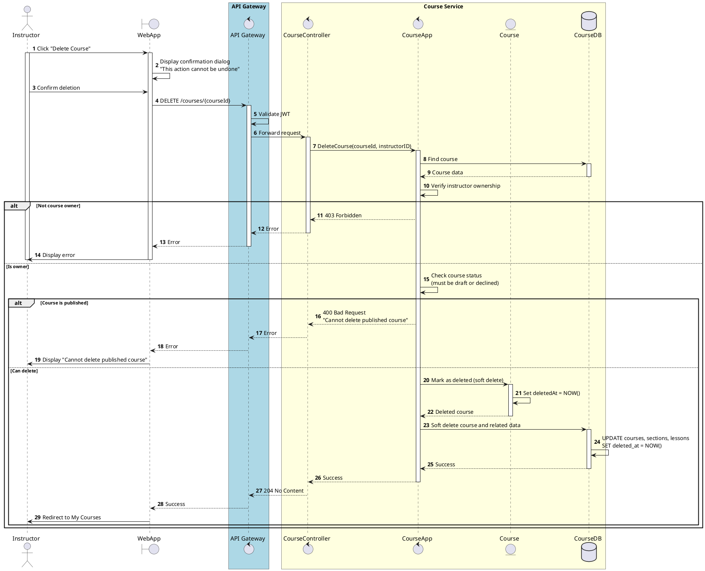

# Sequence DeleteCourse

:::info
Instructor xóa một khóa học đang ở trạng thái nháp hoặc bị từ chối.
:::

```plantuml
@startuml
autonumber

skinparam BoxPadding 10

actor Instructor as I
boundary WebApp as WA

box "API Gateway" #LightBlue
  control "API Gateway" as GW
end box

box "Course Service" #LightYellow
  control CourseController as CC
  control CourseApp as CA
  entity Course as C
  database CourseDB as CDB
end box

I -> WA: Click "Delete Course"
activate I
activate WA
WA -> WA: Display confirmation dialog\n"This action cannot be undone"

I -> WA: Confirm deletion

WA -> GW: DELETE /courses/{courseId}
activate GW
GW -> GW: Validate JWT
GW -> CC: Forward request
activate CC

CC -> CA: DeleteCourse(courseId, instructorID)
activate CA

CA -> CDB: Find course
activate CDB
CA <-- CDB: Course data
deactivate CDB

CA -> CA: Verify instructor ownership

alt Not course owner
  CC <-- CA: 403 Forbidden
  GW <-- CC: Error
  deactivate CC
  WA <-- GW: Error
  deactivate GW
  WA -> I: Display error
  deactivate WA
  deactivate I
else Is owner
  CA -> CA: Check course status\n(must be draft or declined)

  alt Course is published
    CC <-- CA: 400 Bad Request\n"Cannot delete published course"
    GW <-- CC: Error
    deactivate CC
    WA <-- GW: Error
    deactivate GW
    WA -> I: Display "Cannot delete published course"
    deactivate WA
    deactivate I
  else Can delete
    CA -> C: Mark as deleted (soft delete)
    activate C
    C -> C: Set deletedAt = NOW()
    CA <-- C: Deleted course
    deactivate C

    CA -> CDB: Soft delete course and related data
    activate CDB
    CDB -> CDB: UPDATE courses, sections, lessons\nSET deleted_at = NOW()
    CA <-- CDB: Success
    deactivate CDB

    CC <-- CA: Success
    deactivate CA
    GW <-- CC: 204 No Content
    deactivate CC
    WA <-- GW: Success
    deactivate GW
    WA -> I: Redirect to My Courses
    deactivate WA
    deactivate I
  end
end

@enduml
```

<!-- diagram id="sequence-egolia-course-delete-course" -->
