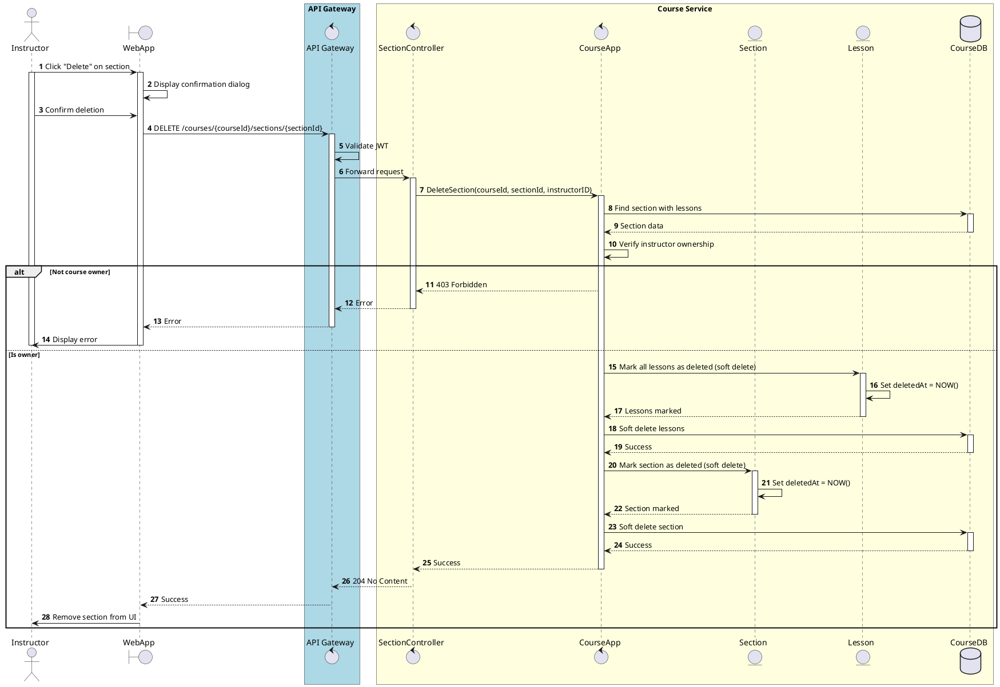

# Sequence DeleteSection

:::info
Instructor xóa một chương (bao gồm cả các bài giảng bên trong).
:::

```plantuml
@startuml
autonumber

skinparam BoxPadding 10

actor Instructor as I
boundary WebApp as WA

box "API Gateway" #LightBlue
  control "API Gateway" as GW
end box

box "Course Service" #LightYellow
  control SectionController as SC
  control CourseApp as CA
  entity Section as S
  entity Lesson as L
  database CourseDB as CDB
end box

I -> WA: Click "Delete" on section
activate I
activate WA
WA -> WA: Display confirmation dialog

I -> WA: Confirm deletion

WA -> GW: DELETE /courses/{courseId}/sections/{sectionId}
activate GW
GW -> GW: Validate JWT
GW -> SC: Forward request
activate SC

SC -> CA: DeleteSection(courseId, sectionId, instructorID)
activate CA

CA -> CDB: Find section with lessons
activate CDB
CA <-- CDB: Section data
deactivate CDB

CA -> CA: Verify instructor ownership

alt Not course owner
  SC <-- CA: 403 Forbidden
  GW <-- SC: Error
  deactivate SC
  WA <-- GW: Error
  deactivate GW
  WA -> I: Display error
  deactivate WA
  deactivate I
else Is owner
  CA -> L: Mark all lessons as deleted (soft delete)
  activate L
  L -> L: Set deletedAt = NOW()
  CA <-- L: Lessons marked
  deactivate L

  CA -> CDB: Soft delete lessons
  activate CDB
  CA <-- CDB: Success
  deactivate CDB

  CA -> S: Mark section as deleted (soft delete)
  activate S
  S -> S: Set deletedAt = NOW()
  CA <-- S: Section marked
  deactivate S

  CA -> CDB: Soft delete section
  activate CDB
  CA <-- CDB: Success
  deactivate CDB

  SC <-- CA: Success
  deactivate CA
  GW <-- SC: 204 No Content
  deactivate SC
  WA <-- GW: Success
  deactivate GW
  WA -> I: Remove section from UI
  deactivate WA
  deactivate I
end

@enduml
```

<!-- diagram id="sequence-egolia-course-delete-section" -->
