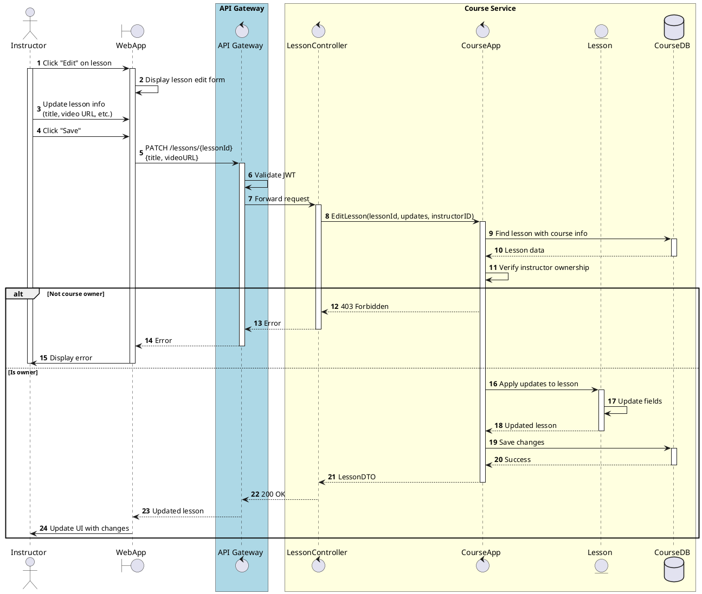

# Sequence EditLesson

:::info
Instructor cập nhật nội dung bài học, đổi tiêu đề hoặc thay link video.
:::

```plantuml
@startuml
autonumber

skinparam BoxPadding 10

actor Instructor as I
boundary WebApp as WA

box "API Gateway" #LightBlue
  control "API Gateway" as GW
end box

box "Course Service" #LightYellow
  control LessonController as LC
  control CourseApp as CA
  entity Lesson as L
  database CourseDB as CDB
end box

I -> WA: Click "Edit" on lesson
activate I
activate WA
WA -> WA: Display lesson edit form

I -> WA: Update lesson info\n(title, video URL, etc.)
I -> WA: Click "Save"

WA -> GW: PATCH /lessons/{lessonId}\n{title, videoURL}
activate GW
GW -> GW: Validate JWT
GW -> LC: Forward request
activate LC

LC -> CA: EditLesson(lessonId, updates, instructorID)
activate CA

CA -> CDB: Find lesson with course info
activate CDB
CA <-- CDB: Lesson data
deactivate CDB

CA -> CA: Verify instructor ownership

alt Not course owner
  LC <-- CA: 403 Forbidden
  GW <-- LC: Error
  deactivate LC
  WA <-- GW: Error
  deactivate GW
  WA -> I: Display error
  deactivate WA
  deactivate I
else Is owner
  CA -> L: Apply updates to lesson
  activate L
  L -> L: Update fields
  CA <-- L: Updated lesson
  deactivate L

  CA -> CDB: Save changes
  activate CDB
  CA <-- CDB: Success
  deactivate CDB

  LC <-- CA: LessonDTO
  deactivate CA
  GW <-- LC: 200 OK
  deactivate LC
  WA <-- GW: Updated lesson
  deactivate GW
  WA -> I: Update UI with changes
  deactivate WA
  deactivate I
end

@enduml
```

<!-- diagram id="sequence-egolia-course-edit-lesson" -->
