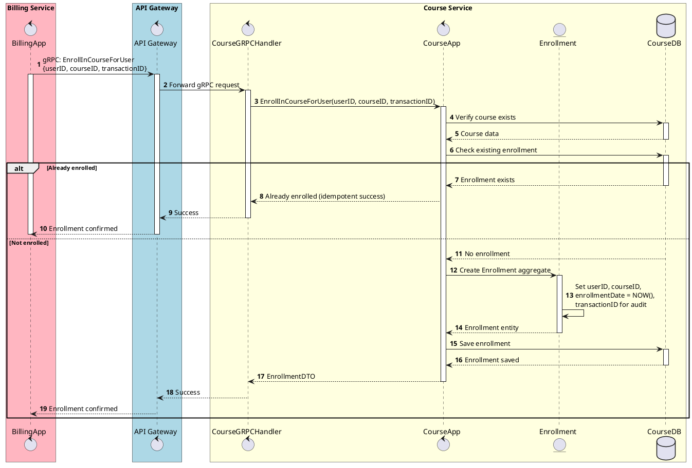

# Sequence EnrollInCourseForUser

:::info
Hệ thống ghi nhận trạng thái Enrolled cho user thông qua giao thức nội bộ (Proto/gRPC).
Được gọi từ Billing Service sau khi thanh toán thành công.
:::

<!-- diagram id="sequence-egolia-course-enroll-for-user" -->
