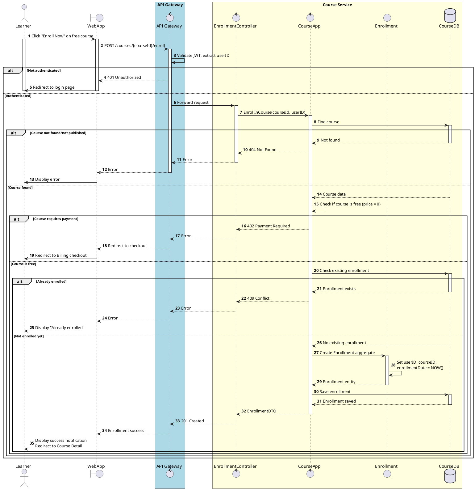

# Sequence EnrollInCourse

:::info
Đăng ký trực tiếp vào khóa học miễn phí (Price = 0).
:::

```plantuml
@startuml
autonumber

skinparam BoxPadding 10

actor Learner as L
boundary WebApp as WA

box "API Gateway" #LightBlue
  control "API Gateway" as GW
end box

box "Course Service" #LightYellow
  control EnrollmentController as EC
  control CourseApp as CA
  entity Enrollment as E
  database CourseDB as CDB
end box

L -> WA: Click "Enroll Now" on free course
activate L
activate WA

WA -> GW: POST /courses/{courseId}/enroll
activate GW
GW -> GW: Validate JWT, extract userID

alt Not authenticated
  WA <-- GW: 401 Unauthorized
  WA -> L: Redirect to login page
  deactivate WA
  deactivate L
else Authenticated
  GW -> EC: Forward request
  activate EC

  EC -> CA: EnrollInCourse(courseId, userID)
  activate CA

  CA -> CDB: Find course
  activate CDB

  alt Course not found/not published
    CA <-- CDB: Not found
    deactivate CDB
    EC <-- CA: 404 Not Found
    GW <-- EC: Error
    deactivate EC
    WA <-- GW: Error
    deactivate GW
    WA -> L: Display error
    deactivate WA
    deactivate L
  else Course found
    CA <-- CDB: Course data
    deactivate CDB

    CA -> CA: Check if course is free (price = 0)

    alt Course requires payment
      EC <-- CA: 402 Payment Required
      GW <-- EC: Error
      deactivate EC
      WA <-- GW: Redirect to checkout
      deactivate GW
      WA -> L: Redirect to Billing checkout
      deactivate WA
      deactivate L
    else Course is free
      CA -> CDB: Check existing enrollment
      activate CDB

      alt Already enrolled
        CA <-- CDB: Enrollment exists
        deactivate CDB
        EC <-- CA: 409 Conflict
        GW <-- EC: Error
        deactivate EC
        WA <-- GW: Error
        deactivate GW
        WA -> L: Display "Already enrolled"
        deactivate WA
        deactivate L
      else Not enrolled yet
        CA <-- CDB: No existing enrollment
        deactivate CDB

        CA -> E: Create Enrollment aggregate
        activate E
        E -> E: Set userID, courseID,\nenrollmentDate = NOW()
        CA <-- E: Enrollment entity
        deactivate E

        CA -> CDB: Save enrollment
        activate CDB
        CA <-- CDB: Enrollment saved
        deactivate CDB

        EC <-- CA: EnrollmentDTO
        deactivate CA
        GW <-- EC: 201 Created
        deactivate EC
        WA <-- GW: Enrollment success
        deactivate GW
        WA -> L: Display success notification\nRedirect to Course Detail
        deactivate WA
        deactivate L
      end
    end
  end
end

@enduml
```

<!-- diagram id="sequence-egolia-course-enroll-in-course" -->
