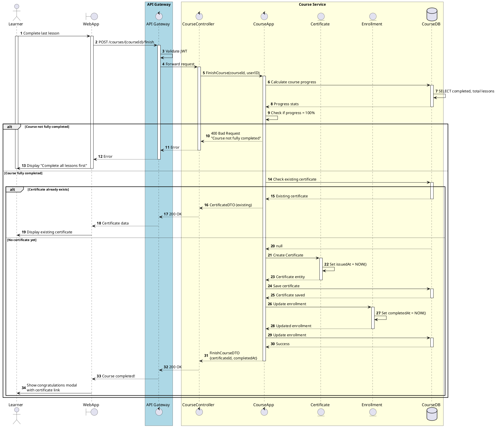

# Sequence FinishCourse

:::info
Xử lý hoàn thành khóa học và kích hoạt tạo chứng chỉ.
:::

```plantuml
@startuml
autonumber

skinparam BoxPadding 10

actor Learner as L
boundary WebApp as WA

box "API Gateway" #LightBlue
  control "API Gateway" as GW
end box

box "Course Service" #LightYellow
  control CourseController as CC
  control CourseApp as CA
  entity Certificate as Cert
  entity Enrollment as E
  database CourseDB as CDB
end box

L -> WA: Complete last lesson
activate L
activate WA

WA -> GW: POST /courses/{courseId}/finish
activate GW
GW -> GW: Validate JWT
GW -> CC: Forward request
activate CC

CC -> CA: FinishCourse(courseId, userID)
activate CA

CA -> CDB: Calculate course progress
activate CDB
CDB -> CDB: SELECT completed, total lessons
CA <-- CDB: Progress stats
deactivate CDB

CA -> CA: Check if progress = 100%

alt Course not fully completed
  CC <-- CA: 400 Bad Request\n"Course not fully completed"
  GW <-- CC: Error
  deactivate CC
  WA <-- GW: Error
  deactivate GW
  WA -> L: Display "Complete all lessons first"
  deactivate WA
  deactivate L
else Course fully completed
  CA -> CDB: Check existing certificate
  activate CDB

  alt Certificate already exists
    CA <-- CDB: Existing certificate
    deactivate CDB
    CC <-- CA: CertificateDTO (existing)
    GW <-- CC: 200 OK
    deactivate CC
    WA <-- GW: Certificate data
    deactivate GW
    WA -> L: Display existing certificate
    deactivate WA
    deactivate L
  else No certificate yet
    CA <-- CDB: null
    deactivate CDB

    CA -> Cert: Create Certificate
    activate Cert
    Cert -> Cert: Set issuedAt = NOW()
    CA <-- Cert: Certificate entity
    deactivate Cert

    CA -> CDB: Save certificate
    activate CDB
    CA <-- CDB: Certificate saved
    deactivate CDB

    CA -> E: Update enrollment
    activate E
    E -> E: Set completedAt = NOW()
    CA <-- E: Updated enrollment
    deactivate E

    CA -> CDB: Update enrollment
    activate CDB
    CA <-- CDB: Success
    deactivate CDB

    CC <-- CA: FinishCourseDTO\n{certificateId, completedAt}
    deactivate CA
    GW <-- CC: 200 OK
    deactivate CC
    WA <-- GW: Course completed!
    deactivate GW

    WA -> L: Show congratulations modal\nwith certificate link
    deactivate WA
    deactivate L
  end
end

@enduml
```

<!-- diagram id="sequence-egolia-course-finish-course" -->
