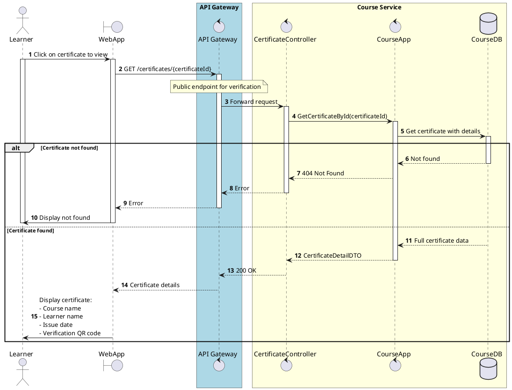

# Sequence GetCertificateById

:::info
Truy xuất chi tiết một chứng chỉ cụ thể.
:::

```plantuml
@startuml
autonumber

skinparam BoxPadding 10

actor Learner as L
boundary WebApp as WA

box "API Gateway" #LightBlue
  control "API Gateway" as GW
end box

box "Course Service" #LightYellow
  control CertificateController as CertC
  control CourseApp as CA
  database CourseDB as CDB
end box

L -> WA: Click on certificate to view
activate L
activate WA

WA -> GW: GET /certificates/{certificateId}
activate GW

note over GW: Public endpoint for verification

GW -> CertC: Forward request
activate CertC

CertC -> CA: GetCertificateById(certificateId)
activate CA

CA -> CDB: Get certificate with details
activate CDB

alt Certificate not found
  CA <-- CDB: Not found
  deactivate CDB
  CertC <-- CA: 404 Not Found
  GW <-- CertC: Error
  deactivate CertC
  WA <-- GW: Error
  deactivate GW
  WA -> L: Display not found
  deactivate WA
  deactivate L
else Certificate found
  CA <-- CDB: Full certificate data
  deactivate CDB

  CertC <-- CA: CertificateDetailDTO
  deactivate CA
  GW <-- CertC: 200 OK
  deactivate CertC
  WA <-- GW: Certificate details
  deactivate GW

  WA -> L: Display certificate:\n- Course name\n- Learner name\n- Issue date\n- Verification QR code
  deactivate WA
  deactivate L
end

@enduml
```

<!-- diagram id="sequence-egolia-course-get-certificate-by-id" -->
