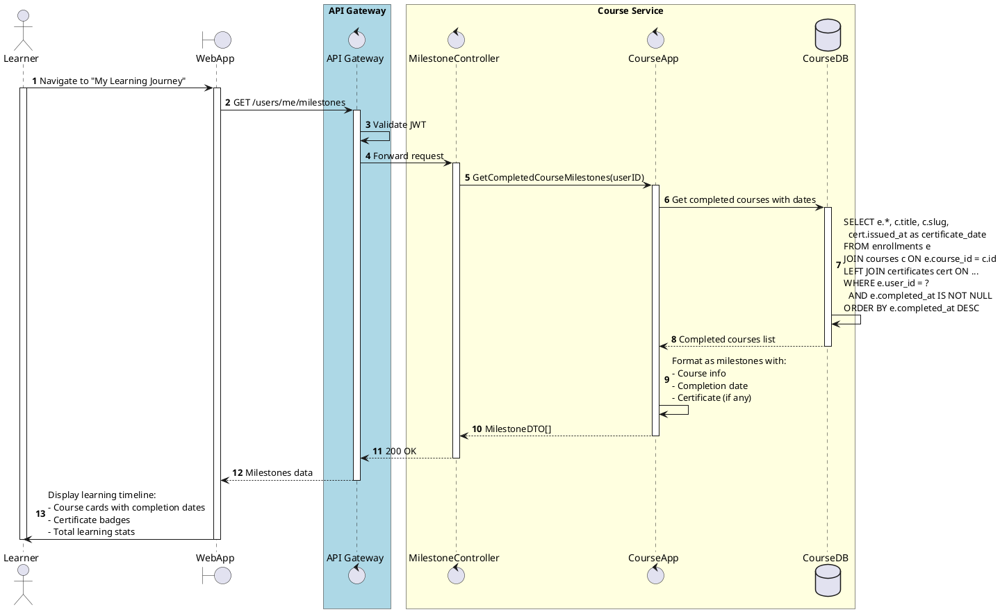

# Sequence GetCompletedCourseMilestones

:::info
Lấy danh sách khóa học đã hoàn thành (progress = 100%) kèm ngày tháng.
:::

```plantuml
@startuml
autonumber

skinparam BoxPadding 10

actor Learner as L
boundary WebApp as WA

box "API Gateway" #LightBlue
  control "API Gateway" as GW
end box

box "Course Service" #LightYellow
  control MilestoneController as MC
  control CourseApp as CA
  database CourseDB as CDB
end box

L -> WA: Navigate to "My Learning Journey"
activate L
activate WA

WA -> GW: GET /users/me/milestones
activate GW
GW -> GW: Validate JWT
GW -> MC: Forward request
activate MC

MC -> CA: GetCompletedCourseMilestones(userID)
activate CA

CA -> CDB: Get completed courses with dates
activate CDB
CDB -> CDB: SELECT e.*, c.title, c.slug,\n  cert.issued_at as certificate_date\nFROM enrollments e\nJOIN courses c ON e.course_id = c.id\nLEFT JOIN certificates cert ON ...\nWHERE e.user_id = ?\n  AND e.completed_at IS NOT NULL\nORDER BY e.completed_at DESC
CA <-- CDB: Completed courses list
deactivate CDB

CA -> CA: Format as milestones with:\n- Course info\n- Completion date\n- Certificate (if any)

MC <-- CA: MilestoneDTO[]
deactivate CA
GW <-- MC: 200 OK
deactivate MC
WA <-- GW: Milestones data
deactivate GW

WA -> L: Display learning timeline:\n- Course cards with completion dates\n- Certificate badges\n- Total learning stats
deactivate WA
deactivate L

@enduml
```

<!-- diagram id="sequence-egolia-course-get-completed-milestones" -->
