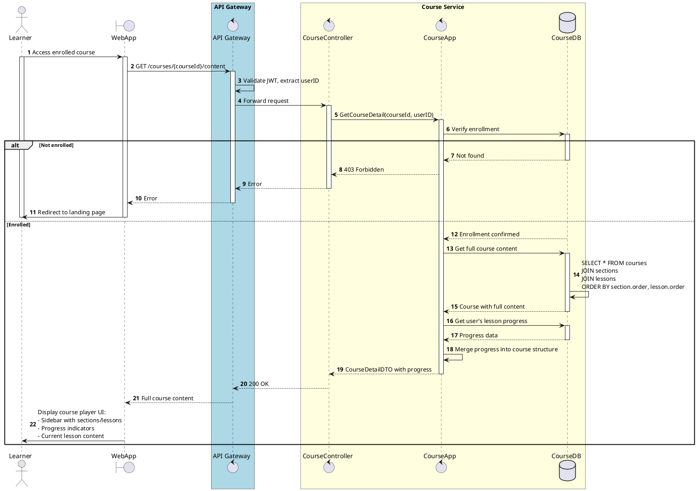

# Sequence GetCourseDetail

:::info
Truy xuất toàn bộ nội dung cấu trúc khóa học (bao gồm danh sách lesson ID) để bắt đầu học.
:::

```plantuml
@startuml
autonumber

skinparam BoxPadding 10

actor Learner as L
boundary WebApp as WA

box "API Gateway" #LightBlue
  control "API Gateway" as GW
end box

box "Course Service" #LightYellow
  control CourseController as CC
  control CourseApp as CA
  database CourseDB as CDB
end box

L -> WA: Access enrolled course
activate L
activate WA

WA -> GW: GET /courses/{courseId}/content
activate GW
GW -> GW: Validate JWT, extract userID
GW -> CC: Forward request
activate CC

CC -> CA: GetCourseDetail(courseId, userID)
activate CA

CA -> CDB: Verify enrollment
activate CDB

alt Not enrolled
  CA <-- CDB: Not found
  deactivate CDB
  CC <-- CA: 403 Forbidden
  GW <-- CC: Error
  deactivate CC
  WA <-- GW: Error
  deactivate GW
  WA -> L: Redirect to landing page
  deactivate WA
  deactivate L
else Enrolled
  CA <-- CDB: Enrollment confirmed
  deactivate CDB

  CA -> CDB: Get full course content
  activate CDB
  CDB -> CDB: SELECT * FROM courses\nJOIN sections\nJOIN lessons\nORDER BY section.order, lesson.order
  CA <-- CDB: Course with full content
  deactivate CDB

  CA -> CDB: Get user's lesson progress
  activate CDB
  CA <-- CDB: Progress data
  deactivate CDB

  CA -> CA: Merge progress into course structure

  CC <-- CA: CourseDetailDTO with progress
  deactivate CA
  GW <-- CC: 200 OK
  deactivate CC
  WA <-- GW: Full course content
  deactivate GW

  WA -> L: Display course player UI:\n- Sidebar with sections/lessons\n- Progress indicators\n- Current lesson content
  deactivate WA
  deactivate L
end

@enduml
```

<!-- diagram id="sequence-egolia-course-get-course-detail" -->
