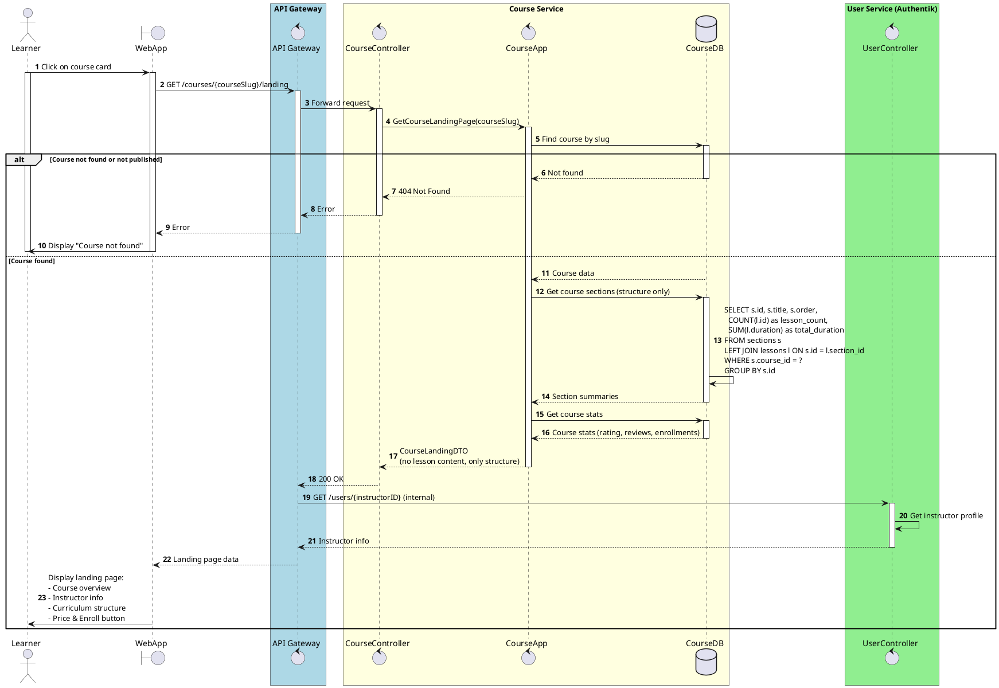

# Sequence GetCourseLandingPage

:::info
Xem trang giới thiệu khóa học (chỉ video intro/overview), không trả về toàn bộ bài học.
:::

```plantuml
@startuml
autonumber

skinparam BoxPadding 10

actor Learner as L
boundary WebApp as WA

box "API Gateway" #LightBlue
  control "API Gateway" as GW
end box

box "Course Service" #LightYellow
  control CourseController as CC
  control CourseApp as CA
  database CourseDB as CDB
end box

box "User Service (Authentik)" #LightGreen
  control UserController as UC
end box

L -> WA: Click on course card
activate L
activate WA

WA -> GW: GET /courses/{courseSlug}/landing
activate GW
GW -> CC: Forward request
activate CC

CC -> CA: GetCourseLandingPage(courseSlug)
activate CA

CA -> CDB: Find course by slug
activate CDB

alt Course not found or not published
  CA <-- CDB: Not found
  deactivate CDB
  CC <-- CA: 404 Not Found
  GW <-- CC: Error
  deactivate CC
  WA <-- GW: Error
  deactivate GW
  WA -> L: Display "Course not found"
  deactivate WA
  deactivate L
else Course found
  CA <-- CDB: Course data
  deactivate CDB

  CA -> CDB: Get course sections (structure only)
  activate CDB
  CDB -> CDB: SELECT s.id, s.title, s.order,\n  COUNT(l.id) as lesson_count,\n  SUM(l.duration) as total_duration\nFROM sections s\nLEFT JOIN lessons l ON s.id = l.section_id\nWHERE s.course_id = ?\nGROUP BY s.id
  CA <-- CDB: Section summaries
  deactivate CDB

  CA -> CDB: Get course stats
  activate CDB
  CA <-- CDB: Course stats (rating, reviews, enrollments)
  deactivate CDB

  CC <-- CA: CourseLandingDTO\n(no lesson content, only structure)
  deactivate CA
  GW <-- CC: 200 OK
  deactivate CC

  GW -> UC: GET /users/{instructorID} (internal)
  activate UC
  UC -> UC: Get instructor profile
  GW <-- UC: Instructor info
  deactivate UC

  WA <-- GW: Landing page data
  deactivate GW

  WA -> L: Display landing page:\n- Course overview\n- Instructor info\n- Curriculum structure\n- Price & Enroll button
  deactivate WA
  deactivate L
end

@enduml
```

<!-- diagram id="sequence-egolia-course-get-landing-page" -->
