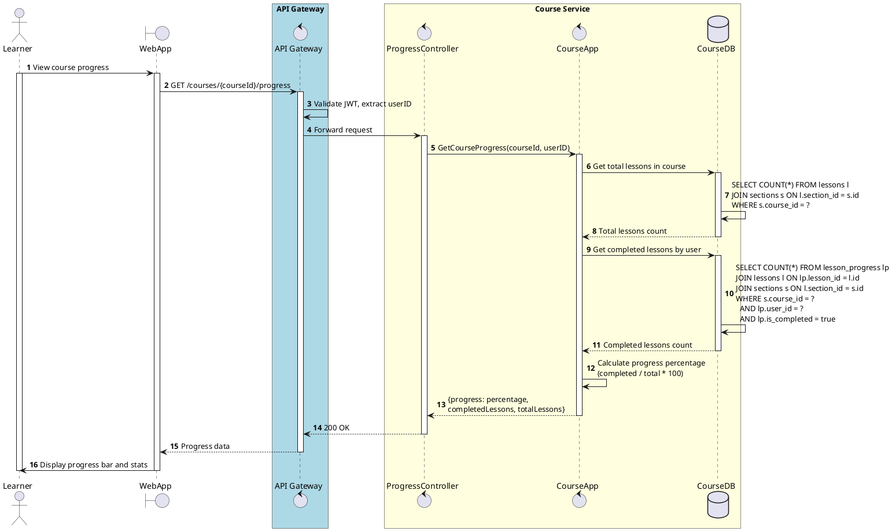

# Sequence GetCourseProgress

:::info
Tính toán và hiển thị % tiến độ toàn bộ khóa học.
:::

```plantuml
@startuml
autonumber

skinparam BoxPadding 10

actor Learner as L
boundary WebApp as WA

box "API Gateway" #LightBlue
  control "API Gateway" as GW
end box

box "Course Service" #LightYellow
  control ProgressController as PC
  control CourseApp as CA
  database CourseDB as CDB
end box

L -> WA: View course progress
activate L
activate WA

WA -> GW: GET /courses/{courseId}/progress
activate GW
GW -> GW: Validate JWT, extract userID
GW -> PC: Forward request
activate PC

PC -> CA: GetCourseProgress(courseId, userID)
activate CA

CA -> CDB: Get total lessons in course
activate CDB
CDB -> CDB: SELECT COUNT(*) FROM lessons l\nJOIN sections s ON l.section_id = s.id\nWHERE s.course_id = ?
CA <-- CDB: Total lessons count
deactivate CDB

CA -> CDB: Get completed lessons by user
activate CDB
CDB -> CDB: SELECT COUNT(*) FROM lesson_progress lp\nJOIN lessons l ON lp.lesson_id = l.id\nJOIN sections s ON l.section_id = s.id\nWHERE s.course_id = ?\n  AND lp.user_id = ?\n  AND lp.is_completed = true
CA <-- CDB: Completed lessons count
deactivate CDB

CA -> CA: Calculate progress percentage\n(completed / total * 100)

PC <-- CA: {progress: percentage,\ncompletedLessons, totalLessons}
deactivate CA
GW <-- PC: 200 OK
deactivate PC
WA <-- GW: Progress data
deactivate GW

WA -> L: Display progress bar and stats
deactivate WA
deactivate L

@enduml
```

<!-- diagram id="sequence-egolia-course-get-course-progress" -->
