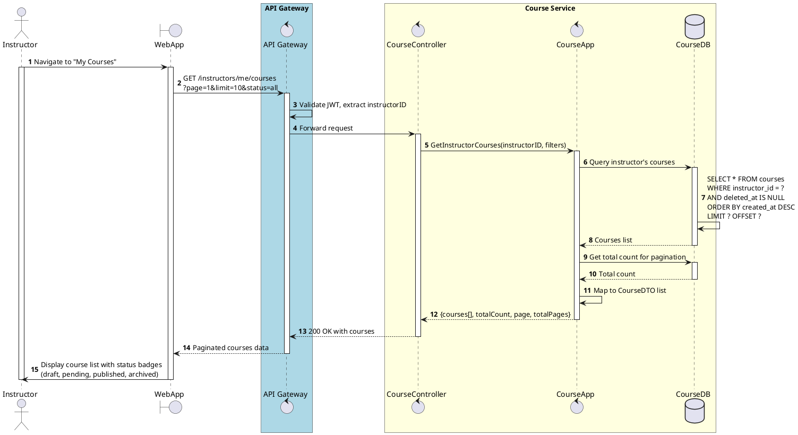

# Sequence GetInstructorCourses

:::info
Lấy danh sách các khóa học do một Instructor cụ thể sở hữu.
:::

```plantuml
@startuml
autonumber

skinparam BoxPadding 10

actor Instructor as I
boundary WebApp as WA

box "API Gateway" #LightBlue
  control "API Gateway" as GW
end box

box "Course Service" #LightYellow
  control CourseController as CC
  control CourseApp as CA
  database CourseDB as CDB
end box

I -> WA: Navigate to "My Courses"
activate I
activate WA

WA -> GW: GET /instructors/me/courses\n?page=1&limit=10&status=all
activate GW
GW -> GW: Validate JWT, extract instructorID
GW -> CC: Forward request
activate CC

CC -> CA: GetInstructorCourses(instructorID, filters)
activate CA

CA -> CDB: Query instructor's courses
activate CDB
CDB -> CDB: SELECT * FROM courses\nWHERE instructor_id = ?\nAND deleted_at IS NULL\nORDER BY created_at DESC\nLIMIT ? OFFSET ?
CA <-- CDB: Courses list
deactivate CDB

CA -> CDB: Get total count for pagination
activate CDB
CA <-- CDB: Total count
deactivate CDB

CA -> CA: Map to CourseDTO list

CC <-- CA: {courses[], totalCount, page, totalPages}
deactivate CA
GW <-- CC: 200 OK with courses
deactivate CC
WA <-- GW: Paginated courses data
deactivate GW

WA -> I: Display course list with status badges\n(draft, pending, published, archived)
deactivate WA
deactivate I

@enduml
```

<!-- diagram id="sequence-egolia-course-get-instructor-courses" -->
