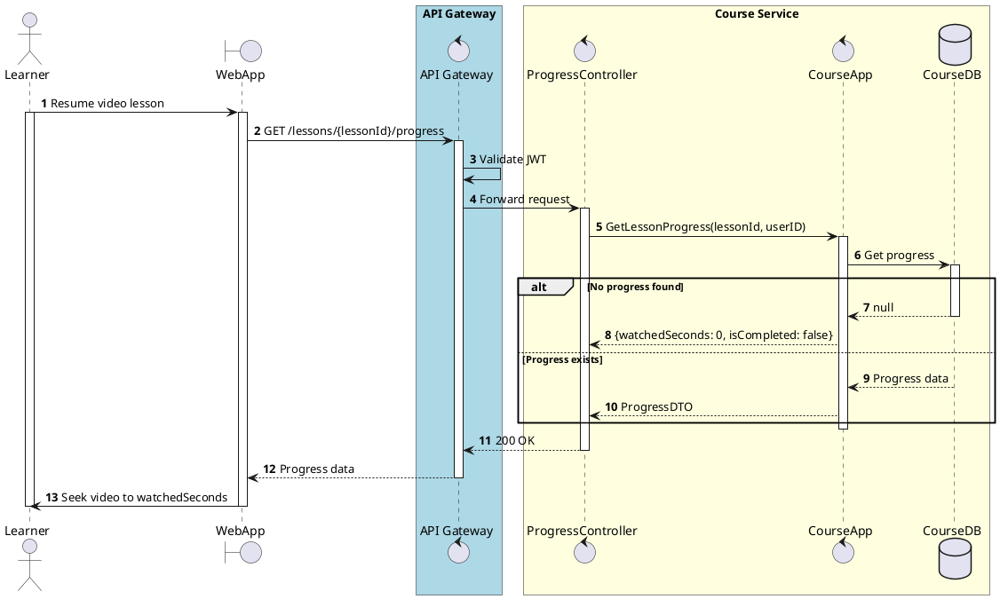

# Sequence GetLessonProgress

:::info
Lấy lại vị trí thời gian đã dừng trước đó của video.
:::

```plantuml
@startuml
autonumber

skinparam BoxPadding 10

actor Learner as L
boundary WebApp as WA

box "API Gateway" #LightBlue
  control "API Gateway" as GW
end box

box "Course Service" #LightYellow
  control ProgressController as PC
  control CourseApp as CA
  database CourseDB as CDB
end box

L -> WA: Resume video lesson
activate L
activate WA

WA -> GW: GET /lessons/{lessonId}/progress
activate GW
GW -> GW: Validate JWT
GW -> PC: Forward request
activate PC

PC -> CA: GetLessonProgress(lessonId, userID)
activate CA

CA -> CDB: Get progress
activate CDB

alt No progress found
  CA <-- CDB: null
  deactivate CDB
  PC <-- CA: {watchedSeconds: 0, isCompleted: false}
else Progress exists
  CA <-- CDB: Progress data
  deactivate CDB
  PC <-- CA: ProgressDTO
end

deactivate CA
GW <-- PC: 200 OK
deactivate PC
WA <-- GW: Progress data
deactivate GW

WA -> L: Seek video to watchedSeconds
deactivate WA
deactivate L

@enduml
```

<!-- diagram id="sequence-egolia-course-get-lesson-progress" -->
