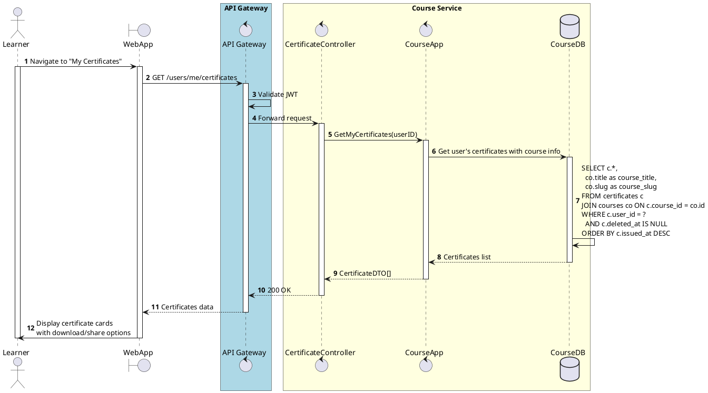

# Sequence GetMyCertificates

:::info
Lấy danh sách toàn bộ chứng chỉ đã lưu trong profile của Learner.
:::

```plantuml
@startuml
autonumber

skinparam BoxPadding 10

actor Learner as L
boundary WebApp as WA

box "API Gateway" #LightBlue
  control "API Gateway" as GW
end box

box "Course Service" #LightYellow
  control CertificateController as CertC
  control CourseApp as CA
  database CourseDB as CDB
end box

L -> WA: Navigate to "My Certificates"
activate L
activate WA

WA -> GW: GET /users/me/certificates
activate GW
GW -> GW: Validate JWT
GW -> CertC: Forward request
activate CertC

CertC -> CA: GetMyCertificates(userID)
activate CA

CA -> CDB: Get user's certificates with course info
activate CDB
CDB -> CDB: SELECT c.*, \n  co.title as course_title,\n  co.slug as course_slug\nFROM certificates c\nJOIN courses co ON c.course_id = co.id\nWHERE c.user_id = ?\n  AND c.deleted_at IS NULL\nORDER BY c.issued_at DESC
CA <-- CDB: Certificates list
deactivate CDB

CertC <-- CA: CertificateDTO[]
deactivate CA
GW <-- CertC: 200 OK
deactivate CertC
WA <-- GW: Certificates data
deactivate GW

WA -> L: Display certificate cards\nwith download/share options
deactivate WA
deactivate L

@enduml
```

<!-- diagram id="sequence-egolia-course-get-my-certificates" -->
