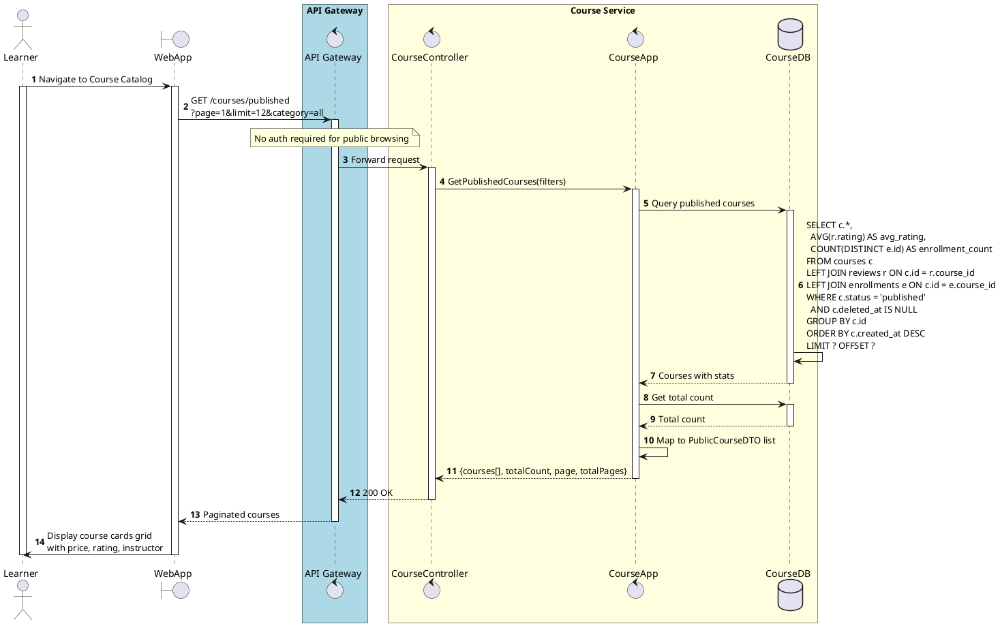

# Sequence GetPublishedCourses

:::info
Learner xem danh sách các khóa học đã được duyệt trên trang chủ.
:::

```plantuml
@startuml
autonumber

skinparam BoxPadding 10

actor Learner as L
boundary WebApp as WA

box "API Gateway" #LightBlue
  control "API Gateway" as GW
end box

box "Course Service" #LightYellow
  control CourseController as CC
  control CourseApp as CA
  database CourseDB as CDB
end box

L -> WA: Navigate to Course Catalog
activate L
activate WA

WA -> GW: GET /courses/published\n?page=1&limit=12&category=all
activate GW

note over GW: No auth required for public browsing

GW -> CC: Forward request
activate CC

CC -> CA: GetPublishedCourses(filters)
activate CA

CA -> CDB: Query published courses
activate CDB
CDB -> CDB: SELECT c.*, \n  AVG(r.rating) AS avg_rating,\n  COUNT(DISTINCT e.id) AS enrollment_count\nFROM courses c\nLEFT JOIN reviews r ON c.id = r.course_id\nLEFT JOIN enrollments e ON c.id = e.course_id\nWHERE c.status = 'published'\n  AND c.deleted_at IS NULL\nGROUP BY c.id\nORDER BY c.created_at DESC\nLIMIT ? OFFSET ?
CA <-- CDB: Courses with stats
deactivate CDB

CA -> CDB: Get total count
activate CDB
CA <-- CDB: Total count
deactivate CDB

CA -> CA: Map to PublicCourseDTO list

CC <-- CA: {courses[], totalCount, page, totalPages}
deactivate CA
GW <-- CC: 200 OK
deactivate CC
WA <-- GW: Paginated courses
deactivate GW

WA -> L: Display course cards grid\nwith price, rating, instructor
deactivate WA
deactivate L

@enduml
```

<!-- diagram id="sequence-egolia-course-get-published-courses" -->
