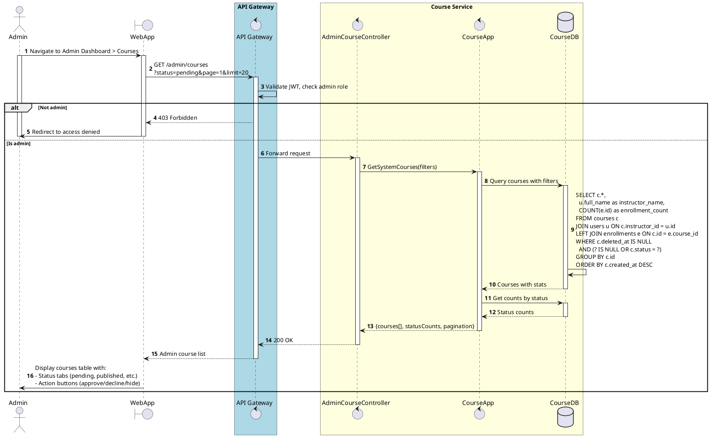

# Sequence GetSystemCourses

:::info
Admin lấy danh sách toàn bộ khóa học trong hệ thống (có param status để lọc khóa pending).
:::

```plantuml
@startuml
autonumber

skinparam BoxPadding 10

actor Admin as A
boundary WebApp as WA

box "API Gateway" #LightBlue
  control "API Gateway" as GW
end box

box "Course Service" #LightYellow
  control AdminCourseController as ACC
  control CourseApp as CA
  database CourseDB as CDB
end box

A -> WA: Navigate to Admin Dashboard > Courses
activate A
activate WA

WA -> GW: GET /admin/courses\n?status=pending&page=1&limit=20
activate GW
GW -> GW: Validate JWT, check admin role

alt Not admin
  WA <-- GW: 403 Forbidden
  WA -> A: Redirect to access denied
  deactivate WA
  deactivate A
else Is admin
  GW -> ACC: Forward request
  activate ACC

  ACC -> CA: GetSystemCourses(filters)
  activate CA

  CA -> CDB: Query courses with filters
  activate CDB
  CDB -> CDB: SELECT c.*,\n  u.full_name as instructor_name,\n  COUNT(e.id) as enrollment_count\nFROM courses c\nJOIN users u ON c.instructor_id = u.id\nLEFT JOIN enrollments e ON c.id = e.course_id\nWHERE c.deleted_at IS NULL\n  AND (? IS NULL OR c.status = ?)\nGROUP BY c.id\nORDER BY c.created_at DESC
  CA <-- CDB: Courses with stats
  deactivate CDB

  CA -> CDB: Get counts by status
  activate CDB
  CA <-- CDB: Status counts
  deactivate CDB

  ACC <-- CA: {courses[], statusCounts, pagination}
  deactivate CA
  GW <-- ACC: 200 OK
  deactivate ACC
  WA <-- GW: Admin course list
  deactivate GW

  WA -> A: Display courses table with:\n- Status tabs (pending, published, etc.)\n- Action buttons (approve/decline/hide)
  deactivate WA
  deactivate A
end

@enduml
```

<!-- diagram id="sequence-egolia-course-get-system-courses" -->
