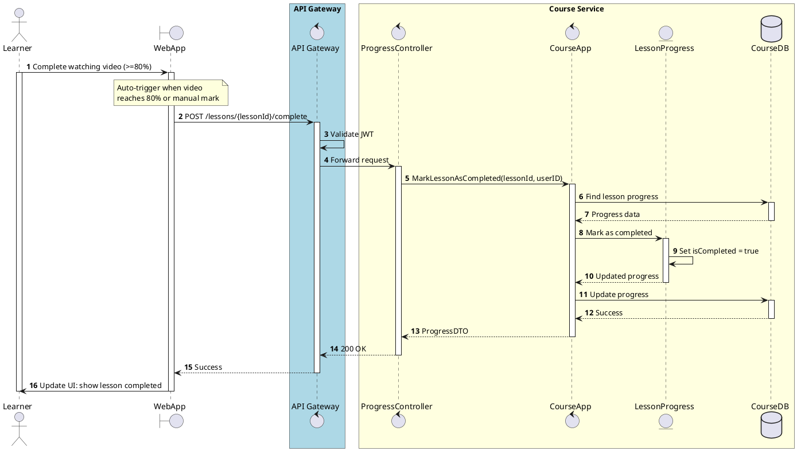

# Sequence MarkLessonAsCompleted

:::info
User tự đánh dấu hoàn thành (khi xem >= 80%), hoặc hệ thống tự động đánh dấu khi đạt 100%.
:::

<!-- diagram id="sequence-egolia-course-mark-lesson-completed" -->
