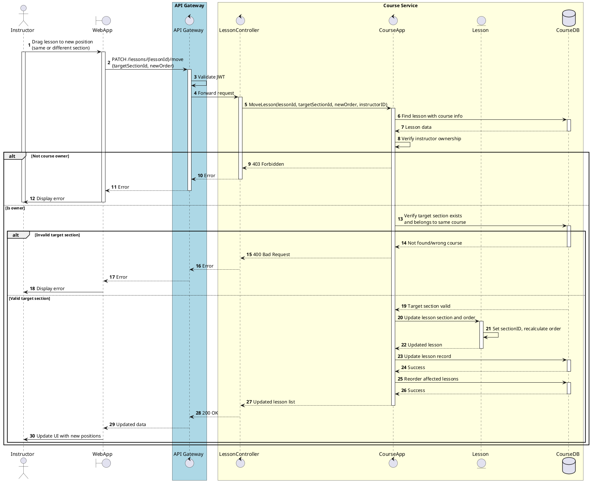

# Sequence MoveLesson

:::info
Instructor thay đổi vị trí bài học (kéo lên/xuống hoặc chuyển sang chương khác).
:::

```plantuml
@startuml
autonumber

skinparam BoxPadding 10

actor Instructor as I
boundary WebApp as WA

box "API Gateway" #LightBlue
  control "API Gateway" as GW
end box

box "Course Service" #LightYellow
  control LessonController as LC
  control CourseApp as CA
  entity Lesson as L
  database CourseDB as CDB
end box

I -> WA: Drag lesson to new position\n(same or different section)
activate I
activate WA

WA -> GW: PATCH /lessons/{lessonId}/move\n{targetSectionId, newOrder}
activate GW
GW -> GW: Validate JWT
GW -> LC: Forward request
activate LC

LC -> CA: MoveLesson(lessonId, targetSectionId, newOrder, instructorID)
activate CA

CA -> CDB: Find lesson with course info
activate CDB
CA <-- CDB: Lesson data
deactivate CDB

CA -> CA: Verify instructor ownership

alt Not course owner
  LC <-- CA: 403 Forbidden
  GW <-- LC: Error
  deactivate LC
  WA <-- GW: Error
  deactivate GW
  WA -> I: Display error
  deactivate WA
  deactivate I
else Is owner
  CA -> CDB: Verify target section exists\nand belongs to same course
  activate CDB

  alt Invalid target section
    CA <-- CDB: Not found/wrong course
    deactivate CDB
    LC <-- CA: 400 Bad Request
    GW <-- LC: Error
    deactivate LC
    WA <-- GW: Error
    deactivate GW
    WA -> I: Display error
    deactivate WA
    deactivate I
  else Valid target section
    CA <-- CDB: Target section valid
    deactivate CDB

    CA -> L: Update lesson section and order
    activate L
    L -> L: Set sectionID, recalculate order
    CA <-- L: Updated lesson
    deactivate L

    CA -> CDB: Update lesson record
    activate CDB
    CA <-- CDB: Success
    deactivate CDB

    CA -> CDB: Reorder affected lessons
    activate CDB
    CA <-- CDB: Success
    deactivate CDB

    LC <-- CA: Updated lesson list
    deactivate CA
    GW <-- LC: 200 OK
    deactivate LC
    WA <-- GW: Updated data
    deactivate GW
    WA -> I: Update UI with new positions
    deactivate WA
    deactivate I
  end
end

@enduml
```

<!-- diagram id="sequence-egolia-course-move-lesson" -->
