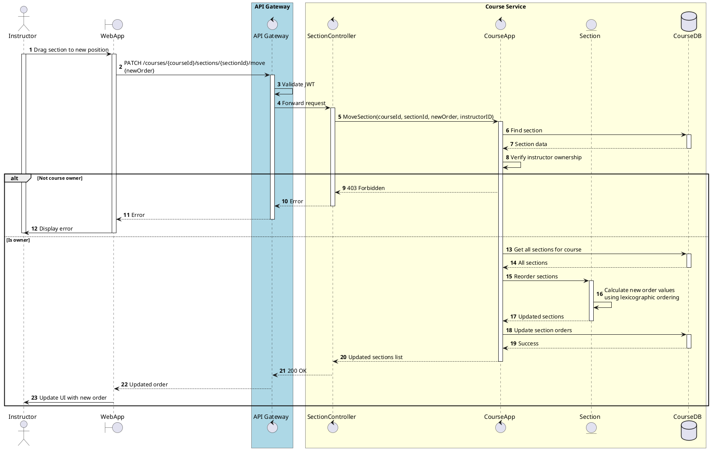

# Sequence MoveSection

:::info
Instructor thay đổi thứ tự hiển thị của các chương trong một khóa học.
:::

```plantuml
@startuml
autonumber

skinparam BoxPadding 10

actor Instructor as I
boundary WebApp as WA

box "API Gateway" #LightBlue
  control "API Gateway" as GW
end box

box "Course Service" #LightYellow
  control SectionController as SC
  control CourseApp as CA
  entity Section as S
  database CourseDB as CDB
end box

I -> WA: Drag section to new position
activate I
activate WA

WA -> GW: PATCH /courses/{courseId}/sections/{sectionId}/move\n{newOrder}
activate GW
GW -> GW: Validate JWT
GW -> SC: Forward request
activate SC

SC -> CA: MoveSection(courseId, sectionId, newOrder, instructorID)
activate CA

CA -> CDB: Find section
activate CDB
CA <-- CDB: Section data
deactivate CDB

CA -> CA: Verify instructor ownership

alt Not course owner
  SC <-- CA: 403 Forbidden
  GW <-- SC: Error
  deactivate SC
  WA <-- GW: Error
  deactivate GW
  WA -> I: Display error
  deactivate WA
  deactivate I
else Is owner
  CA -> CDB: Get all sections for course
  activate CDB
  CA <-- CDB: All sections
  deactivate CDB

  CA -> S: Reorder sections
  activate S
  S -> S: Calculate new order values\nusing lexicographic ordering
  CA <-- S: Updated sections
  deactivate S

  CA -> CDB: Update section orders
  activate CDB
  CA <-- CDB: Success
  deactivate CDB

  SC <-- CA: Updated sections list
  deactivate CA
  GW <-- SC: 200 OK
  deactivate SC
  WA <-- GW: Updated order
  deactivate GW
  WA -> I: Update UI with new order
  deactivate WA
  deactivate I
end

@enduml
```

<!-- diagram id="sequence-egolia-course-move-section" -->
