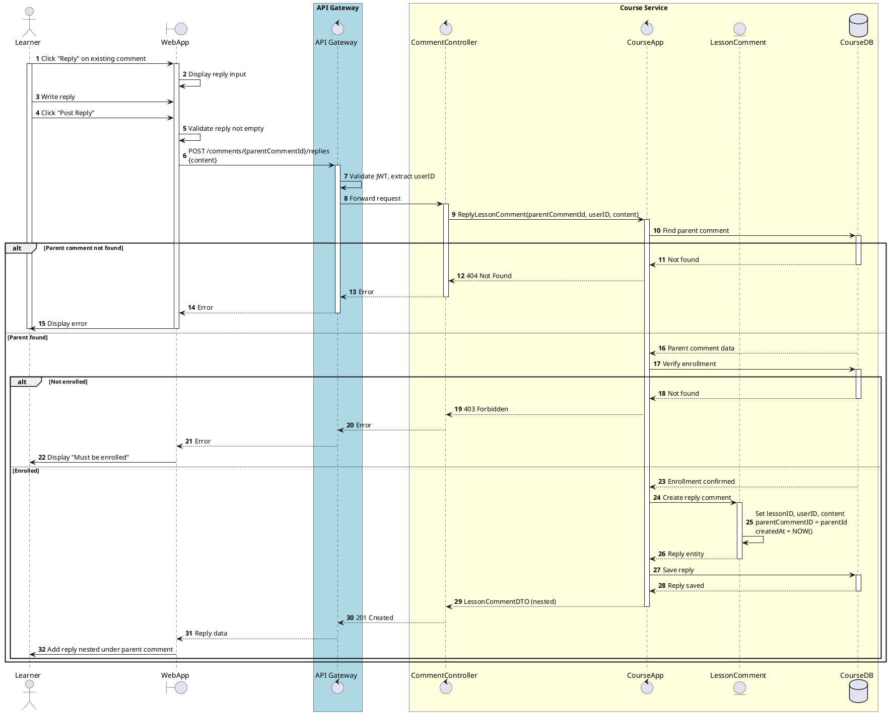

# Sequence ReplyLessonComment

:::info
User khác trả lời bình luận, hệ thống lưu lại dưới dạng nested comment.
:::

```plantuml
@startuml
autonumber

skinparam BoxPadding 10

actor Learner as L
boundary WebApp as WA

box "API Gateway" #LightBlue
  control "API Gateway" as GW
end box

box "Course Service" #LightYellow
  control CommentController as CC
  control CourseApp as CA
  entity LessonComment as LC
  database CourseDB as CDB
end box

L -> WA: Click "Reply" on existing comment
activate L
activate WA
WA -> WA: Display reply input

L -> WA: Write reply
L -> WA: Click "Post Reply"

WA -> WA: Validate reply not empty

WA -> GW: POST /comments/{parentCommentId}/replies\n{content}
activate GW
GW -> GW: Validate JWT, extract userID
GW -> CC: Forward request
activate CC

CC -> CA: ReplyLessonComment(parentCommentId, userID, content)
activate CA

CA -> CDB: Find parent comment
activate CDB

alt Parent comment not found
  CA <-- CDB: Not found
  deactivate CDB
  CC <-- CA: 404 Not Found
  GW <-- CC: Error
  deactivate CC
  WA <-- GW: Error
  deactivate GW
  WA -> L: Display error
  deactivate WA
  deactivate L
else Parent found
  CA <-- CDB: Parent comment data
  deactivate CDB

  CA -> CDB: Verify enrollment
  activate CDB

  alt Not enrolled
    CA <-- CDB: Not found
    deactivate CDB
    CC <-- CA: 403 Forbidden
    GW <-- CC: Error
    deactivate CC
    WA <-- GW: Error
    deactivate GW
    WA -> L: Display "Must be enrolled"
    deactivate WA
    deactivate L
  else Enrolled
    CA <-- CDB: Enrollment confirmed
    deactivate CDB

    CA -> LC: Create reply comment
    activate LC
    LC -> LC: Set lessonID, userID, content\nparentCommentID = parentId\ncreatedAt = NOW()
    CA <-- LC: Reply entity
    deactivate LC

    CA -> CDB: Save reply
    activate CDB
    CA <-- CDB: Reply saved
    deactivate CDB

    CC <-- CA: LessonCommentDTO (nested)
    deactivate CA
    GW <-- CC: 201 Created
    deactivate CC
    WA <-- GW: Reply data
    deactivate GW

    WA -> L: Add reply nested under parent comment
    deactivate WA
    deactivate L
  end
end

@enduml
```

<!-- diagram id="sequence-egolia-course-reply-lesson-comment" -->
