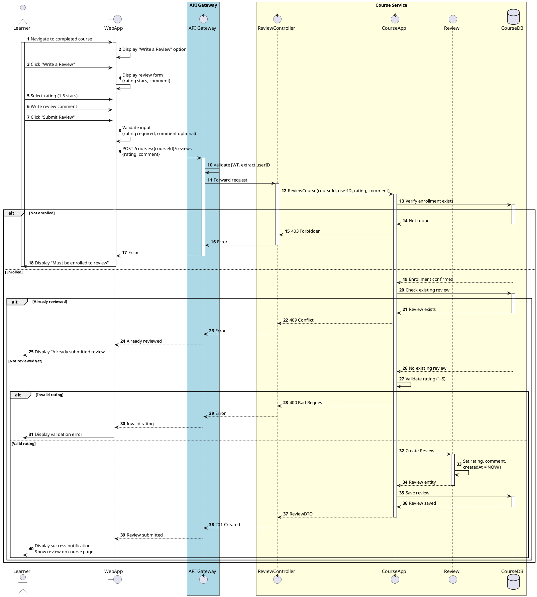

# Sequence ReviewCourse

:::info
Learner mở khóa học đã hoàn thành để viết nhận xét và rate sao.
:::

```plantuml
@startuml
autonumber

skinparam BoxPadding 10

actor Learner as L
boundary WebApp as WA

box "API Gateway" #LightBlue
  control "API Gateway" as GW
end box

box "Course Service" #LightYellow
  control ReviewController as RC
  control CourseApp as CA
  entity Review as R
  database CourseDB as CDB
end box

L -> WA: Navigate to completed course
activate L
activate WA
WA -> WA: Display "Write a Review" option

L -> WA: Click "Write a Review"
WA -> WA: Display review form\n(rating stars, comment)

L -> WA: Select rating (1-5 stars)
L -> WA: Write review comment
L -> WA: Click "Submit Review"

WA -> WA: Validate input\n(rating required, comment optional)

WA -> GW: POST /courses/{courseId}/reviews\n{rating, comment}
activate GW
GW -> GW: Validate JWT, extract userID
GW -> RC: Forward request
activate RC

RC -> CA: ReviewCourse(courseId, userID, rating, comment)
activate CA

CA -> CDB: Verify enrollment exists
activate CDB

alt Not enrolled
  CA <-- CDB: Not found
  deactivate CDB
  RC <-- CA: 403 Forbidden
  GW <-- RC: Error
  deactivate RC
  WA <-- GW: Error
  deactivate GW
  WA -> L: Display "Must be enrolled to review"
  deactivate WA
  deactivate L
else Enrolled
  CA <-- CDB: Enrollment confirmed
  deactivate CDB

  CA -> CDB: Check existing review
  activate CDB

  alt Already reviewed
    CA <-- CDB: Review exists
    deactivate CDB
    RC <-- CA: 409 Conflict
    GW <-- RC: Error
    deactivate RC
    WA <-- GW: Already reviewed
    deactivate GW
    WA -> L: Display "Already submitted review"
    deactivate WA
    deactivate L
  else Not reviewed yet
    CA <-- CDB: No existing review
    deactivate CDB

    CA -> CA: Validate rating (1-5)

    alt Invalid rating
      RC <-- CA: 400 Bad Request
      GW <-- RC: Error
      deactivate RC
      WA <-- GW: Invalid rating
      deactivate GW
      WA -> L: Display validation error
      deactivate WA
      deactivate L
    else Valid rating
      CA -> R: Create Review
      activate R
      R -> R: Set rating, comment,\ncreatedAt = NOW()
      CA <-- R: Review entity
      deactivate R

      CA -> CDB: Save review
      activate CDB
      CA <-- CDB: Review saved
      deactivate CDB

      RC <-- CA: ReviewDTO
      deactivate CA
      GW <-- RC: 201 Created
      deactivate RC
      WA <-- GW: Review submitted
      deactivate GW

      WA -> L: Display success notification\nShow review on course page
      deactivate WA
      deactivate L
    end
  end
end

@enduml
```

<!-- diagram id="sequence-egolia-course-review-course" -->
