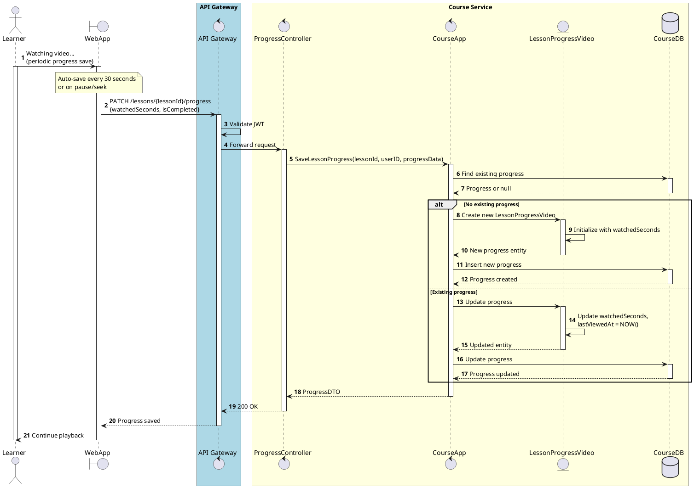

# Sequence SaveLessonProgress

:::info
Lưu vết lại tiến độ thời gian xem video của bài học hiện tại.
:::

```plantuml
@startuml
autonumber

skinparam BoxPadding 10

actor Learner as L
boundary WebApp as WA

box "API Gateway" #LightBlue
  control "API Gateway" as GW
end box

box "Course Service" #LightYellow
  control ProgressController as PC
  control CourseApp as CA
  entity LessonProgressVideo as LPV
  database CourseDB as CDB
end box

L -> WA: Watching video...\n(periodic progress save)
activate L
activate WA

note over WA: Auto-save every 30 seconds\nor on pause/seek

WA -> GW: PATCH /lessons/{lessonId}/progress\n{watchedSeconds, isCompleted}
activate GW
GW -> GW: Validate JWT
GW -> PC: Forward request
activate PC

PC -> CA: SaveLessonProgress(lessonId, userID, progressData)
activate CA

CA -> CDB: Find existing progress
activate CDB
CA <-- CDB: Progress or null
deactivate CDB

alt No existing progress
  CA -> LPV: Create new LessonProgressVideo
  activate LPV
  LPV -> LPV: Initialize with watchedSeconds
  CA <-- LPV: New progress entity
  deactivate LPV

  CA -> CDB: Insert new progress
  activate CDB
  CA <-- CDB: Progress created
  deactivate CDB
else Existing progress
  CA -> LPV: Update progress
  activate LPV
  LPV -> LPV: Update watchedSeconds,\nlastViewedAt = NOW()
  CA <-- LPV: Updated entity
  deactivate LPV

  CA -> CDB: Update progress
  activate CDB
  CA <-- CDB: Progress updated
  deactivate CDB
end

PC <-- CA: ProgressDTO
deactivate CA
GW <-- PC: 200 OK
deactivate PC
WA <-- GW: Progress saved
deactivate GW

WA -> L: Continue playback
deactivate WA
deactivate L

@enduml
```

<!-- diagram id="sequence-egolia-course-save-lesson-progress" -->
