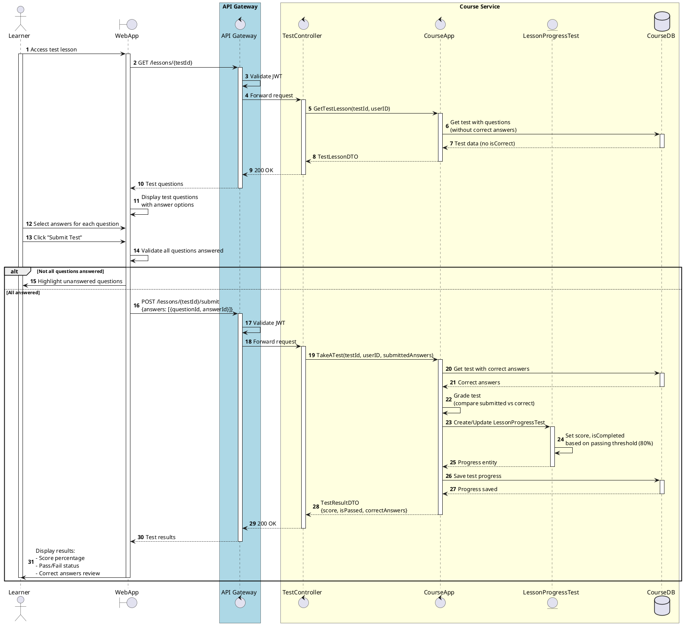

# Sequence TakeATest

:::info
Learner thực hiện bài kiểm tra trắc nghiệm, nộp bài để hệ thống chấm điểm.
:::

```plantuml
@startuml
autonumber

skinparam BoxPadding 10

actor Learner as L
boundary WebApp as WA

box "API Gateway" #LightBlue
  control "API Gateway" as GW
end box

box "Course Service" #LightYellow
  control TestController as TC
  control CourseApp as CA
  entity LessonProgressTest as LPT
  database CourseDB as CDB
end box

L -> WA: Access test lesson
activate L
activate WA

WA -> GW: GET /lessons/{testId}
activate GW
GW -> GW: Validate JWT
GW -> TC: Forward request
activate TC

TC -> CA: GetTestLesson(testId, userID)
activate CA
CA -> CDB: Get test with questions\n(without correct answers)
activate CDB
CA <-- CDB: Test data (no isCorrect)
deactivate CDB
TC <-- CA: TestLessonDTO
deactivate CA
GW <-- TC: 200 OK
deactivate TC
WA <-- GW: Test questions
deactivate GW

WA -> WA: Display test questions\nwith answer options

L -> WA: Select answers for each question
L -> WA: Click "Submit Test"

WA -> WA: Validate all questions answered

alt Not all questions answered
  WA -> L: Highlight unanswered questions
else All answered
  WA -> GW: POST /lessons/{testId}/submit\n{answers: [{questionId, answerId}]}
  activate GW
  GW -> GW: Validate JWT
  GW -> TC: Forward request
  activate TC

  TC -> CA: TakeATest(testId, userID, submittedAnswers)
  activate CA

  CA -> CDB: Get test with correct answers
  activate CDB
  CA <-- CDB: Correct answers
  deactivate CDB

  CA -> CA: Grade test\n(compare submitted vs correct)

  CA -> LPT: Create/Update LessonProgressTest
  activate LPT
  LPT -> LPT: Set score, isCompleted\nbased on passing threshold (80%)
  CA <-- LPT: Progress entity
  deactivate LPT

  CA -> CDB: Save test progress
  activate CDB
  CA <-- CDB: Progress saved
  deactivate CDB

  TC <-- CA: TestResultDTO\n{score, isPassed, correctAnswers}
  deactivate CA
  GW <-- TC: 200 OK
  deactivate TC
  WA <-- GW: Test results
  deactivate GW

  WA -> L: Display results:\n- Score percentage\n- Pass/Fail status\n- Correct answers review
  deactivate WA
  deactivate L
end

@enduml
```

<!-- diagram id="sequence-egolia-course-take-a-test" -->
