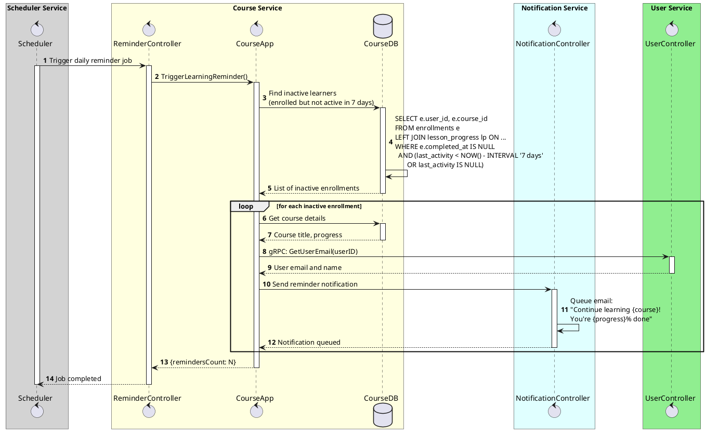

# Sequence TriggerLearningReminder

:::info
Hệ thống nhắc nhở học viên quay lại học.
:::

```plantuml
@startuml
autonumber

skinparam BoxPadding 10

box "Scheduler Service" #LightGray
  control Scheduler as SCH
end box

box "Course Service" #LightYellow
  control ReminderController as RC
  control CourseApp as CA
  database CourseDB as CDB
end box

box "Notification Service" #LightCyan
  control NotificationController as NC
end box

box "User Service" #LightGreen
  control UserController as UC
end box

SCH -> RC: Trigger daily reminder job
activate SCH
activate RC

RC -> CA: TriggerLearningReminder()
activate CA

CA -> CDB: Find inactive learners\n(enrolled but not active in 7 days)
activate CDB
CDB -> CDB: SELECT e.user_id, e.course_id\nFROM enrollments e\nLEFT JOIN lesson_progress lp ON ...\nWHERE e.completed_at IS NULL\n  AND (last_activity < NOW() - INTERVAL '7 days'\n       OR last_activity IS NULL)
CA <-- CDB: List of inactive enrollments
deactivate CDB

loop for each inactive enrollment
  CA -> CDB: Get course details
  activate CDB
  CA <-- CDB: Course title, progress
  deactivate CDB

  CA -> UC: gRPC: GetUserEmail(userID)
  activate UC
  CA <-- UC: User email and name
  deactivate UC

  CA -> NC: Send reminder notification
  activate NC
  NC -> NC: Queue email:\n"Continue learning {course}!\nYou're {progress}% done"
  CA <-- NC: Notification queued
  deactivate NC
end

RC <-- CA: {remindersCount: N}
deactivate CA
SCH <-- RC: Job completed
deactivate RC
deactivate SCH

@enduml
```

<!-- diagram id="sequence-egolia-course-trigger-learning-reminder" -->
