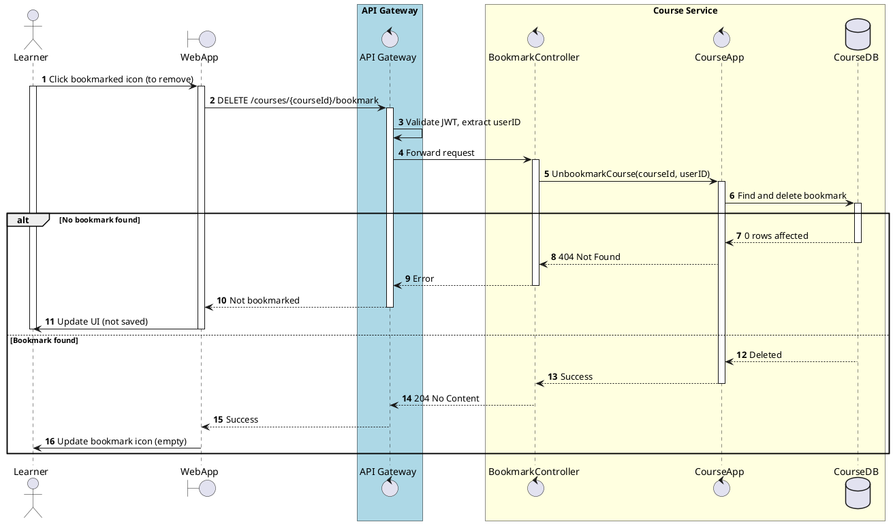

# Sequence UnbookmarkCourse

:::info
Bỏ lưu khóa học khỏi danh sách yêu thích.
:::

```plantuml
@startuml
autonumber

skinparam BoxPadding 10

actor Learner as L
boundary WebApp as WA

box "API Gateway" #LightBlue
  control "API Gateway" as GW
end box

box "Course Service" #LightYellow
  control BookmarkController as BC
  control CourseApp as CA
  database CourseDB as CDB
end box

L -> WA: Click bookmarked icon (to remove)
activate L
activate WA

WA -> GW: DELETE /courses/{courseId}/bookmark
activate GW
GW -> GW: Validate JWT, extract userID
GW -> BC: Forward request
activate BC

BC -> CA: UnbookmarkCourse(courseId, userID)
activate CA

CA -> CDB: Find and delete bookmark
activate CDB

alt No bookmark found
  CA <-- CDB: 0 rows affected
  deactivate CDB
  BC <-- CA: 404 Not Found
  GW <-- BC: Error
  deactivate BC
  WA <-- GW: Not bookmarked
  deactivate GW
  WA -> L: Update UI (not saved)
  deactivate WA
  deactivate L
else Bookmark found
  CA <-- CDB: Deleted
  deactivate CDB

  BC <-- CA: Success
  deactivate CA
  GW <-- BC: 204 No Content
  deactivate BC
  WA <-- GW: Success
  deactivate GW
  WA -> L: Update bookmark icon (empty)
  deactivate WA
  deactivate L
end

@enduml
```

<!-- diagram id="sequence-egolia-course-unbookmark-course" -->
