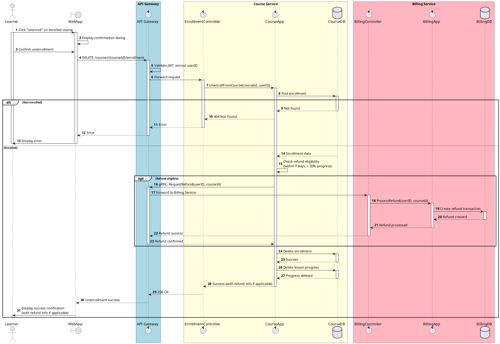

# Sequence UnenrollFromCourse

:::info
Hủy đăng ký khóa học, hệ thống xử lý hoàn tiền nếu thỏa mãn điều kiện.
:::

```plantuml
@startuml
autonumber

skinparam BoxPadding 10

actor Learner as L
boundary WebApp as WA

box "API Gateway" #LightBlue
  control "API Gateway" as GW
end box

box "Course Service" #LightYellow
  control EnrollmentController as EC
  control CourseApp as CA
  database CourseDB as CDB
end box

box "Billing Service" #LightPink
  control BillingController as BC
  control BillingApp as BA
  database BillingDB as BDB
end box

L -> WA: Click "Unenroll" on enrolled course
activate L
activate WA
WA -> WA: Display confirmation dialog

L -> WA: Confirm unenrollment

WA -> GW: DELETE /courses/{courseId}/enrollment
activate GW
GW -> GW: Validate JWT, extract userID
GW -> EC: Forward request
activate EC

EC -> CA: UnenrollFromCourse(courseId, userID)
activate CA

CA -> CDB: Find enrollment
activate CDB

alt Not enrolled
  CA <-- CDB: Not found
  deactivate CDB
  EC <-- CA: 404 Not Found
  GW <-- EC: Error
  deactivate EC
  WA <-- GW: Error
  deactivate GW
  WA -> L: Display error
  deactivate WA
  deactivate L
else Enrolled
  CA <-- CDB: Enrollment data
  deactivate CDB

  CA -> CA: Check refund eligibility\n(within 7 days, < 20% progress)

  opt Refund eligible
    CA -> GW: gRPC: RequestRefund(userID, courseId)
    activate GW
    GW -> BC: Forward to Billing Service
    activate BC
    BC -> BA: ProcessRefund(userID, courseId)
    activate BA
    BA -> BDB: Create refund transaction
    activate BDB
    BA <-- BDB: Refund created
    deactivate BDB
    BC <-- BA: Refund processed
    deactivate BA
    GW <-- BC: Refund success
    deactivate BC
    CA <-- GW: Refund confirmed
    deactivate GW
  end

  CA -> CDB: Delete enrollment
  activate CDB
  CA <-- CDB: Success
  deactivate CDB

  CA -> CDB: Delete lesson progress
  activate CDB
  CA <-- CDB: Progress deleted
  deactivate CDB

  EC <-- CA: Success (with refund info if applicable)
  deactivate CA
  GW <-- EC: 200 OK
  deactivate EC
  WA <-- GW: Unenrollment success
  deactivate GW
  WA -> L: Display success notification\n(with refund info if applicable)
  deactivate WA
  deactivate L
end

@enduml
```

<!-- diagram id="sequence-egolia-course-unenroll" -->
