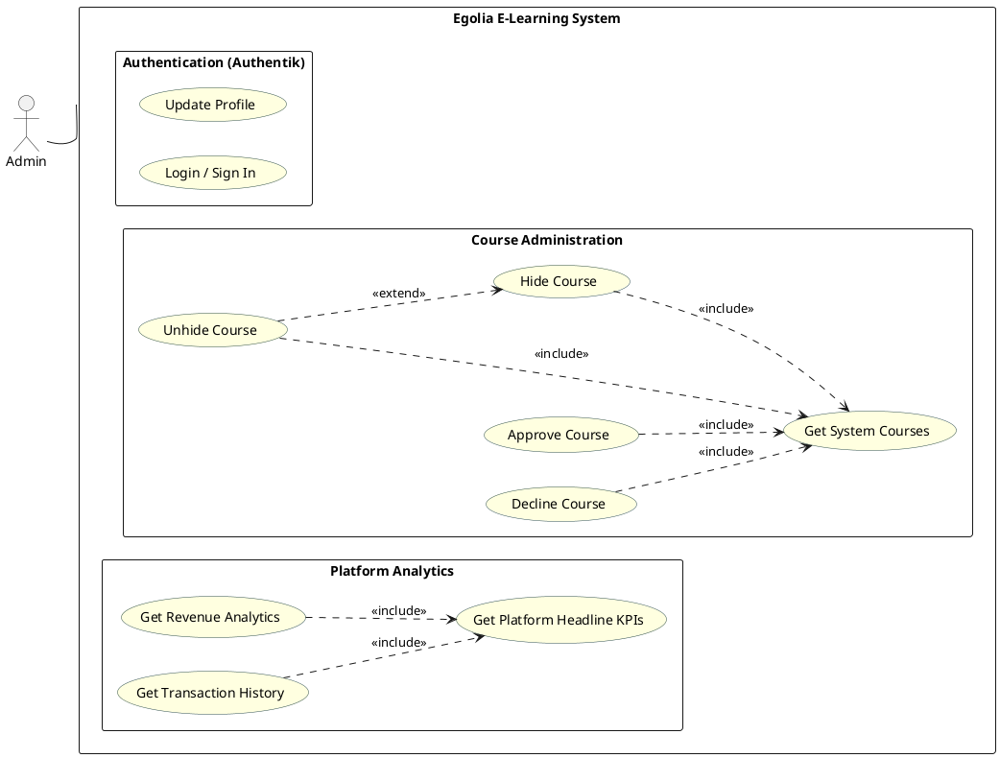

# Use Case Diagram - Admin

```plantuml
@startuml
left to right direction
skinparam packageStyle rectangle
skinparam usecase {
  BackgroundColor LightYellow
  BorderColor DarkSlateGray
}

actor "Admin" as A

rectangle "Egolia E-Learning System" {

  package "Authentication (Authentik)" {
    usecase "Login / Sign In" as UC_LOGIN
    usecase "Update Profile" as UC_PROFILE
  }

  package "Course Administration" {
    usecase "Get System Courses" as UC_SYS_COURSES
    usecase "Approve Course" as UC_APPROVE
    usecase "Decline Course" as UC_DECLINE
    usecase "Hide Course" as UC_HIDE
    usecase "Unhide Course" as UC_UNHIDE
  }

  package "Platform Analytics" {
    usecase "Get Platform Headline KPIs" as UC_KPIS
    usecase "Get Revenue Analytics" as UC_REVENUE
    usecase "Get Transaction History" as UC_TX_HISTORY
  }

  ' === Include ===
  UC_APPROVE ..> UC_SYS_COURSES : <<include>>
  UC_DECLINE ..> UC_SYS_COURSES : <<include>>
  UC_HIDE ..> UC_SYS_COURSES : <<include>>
  UC_UNHIDE ..> UC_SYS_COURSES : <<include>>
  UC_REVENUE ..> UC_KPIS : <<include>>
  UC_TX_HISTORY ..> UC_KPIS : <<include>>

  ' === Extend ===
  UC_UNHIDE ..> UC_HIDE : <<extend>>
}

A -- UC_LOGIN
A -- UC_PROFILE
A -- UC_SYS_COURSES
A -- UC_KPIS

@enduml
```

<!-- diagram id="use-case-egolia-admin" -->
