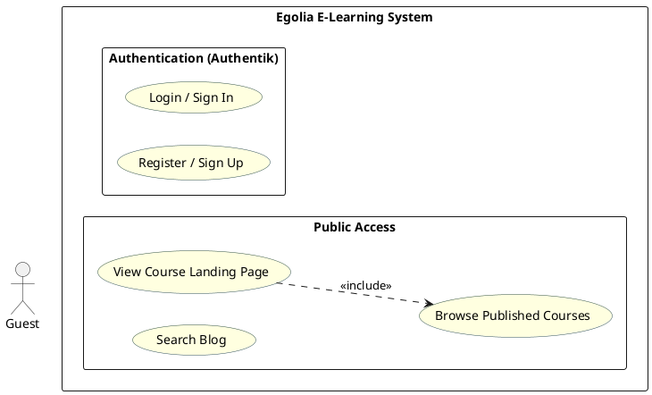

# Use Case Diagram - Guest

```plantuml
@startuml
left to right direction
skinparam packageStyle rectangle
skinparam usecase {
  BackgroundColor LightYellow
  BorderColor DarkSlateGray
}

actor "Guest" as G

rectangle "Egolia E-Learning System" {

  package "Authentication (Authentik)" {
    usecase "Login / Sign In" as UC_LOGIN
    usecase "Register / Sign Up" as UC_REG
  }

  package "Public Access" {
    usecase "Browse Published Courses" as UC_BROWSE
    usecase "View Course Landing Page" as UC_LANDING
    usecase "Search Blog" as UC_SEARCH_BLOG
  }

  ' === Include ===
  UC_LANDING ..> UC_BROWSE : <<include>>
}

G -- UC_LOGIN
G -- UC_REG
G -- UC_BROWSE
G -- UC_SEARCH_BLOG

@enduml
```

<!-- diagram id="use-case-egolia-guest" -->
