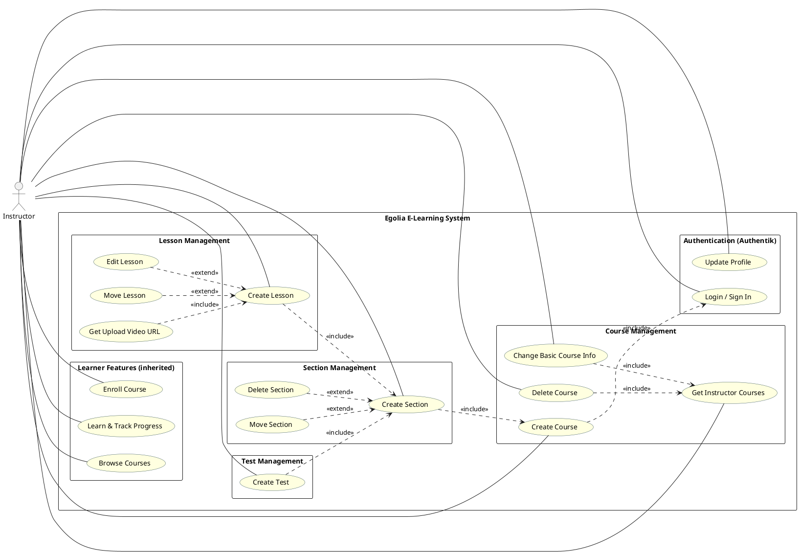

# Use Case Diagram - Instructor

```plantuml
@startuml
left to right direction
skinparam packageStyle rectangle
skinparam usecase {
  BackgroundColor LightYellow
  BorderColor DarkSlateGray
}

actor "Instructor" as I

rectangle "Egolia E-Learning System" {

  package "Authentication (Authentik)" {
    usecase "Login / Sign In" as UC_LOGIN
    usecase "Update Profile" as UC_PROFILE
  }

  package "Course Management" {
    usecase "Create Course" as UC_CREATE
    usecase "Change Basic Course Info" as UC_EDIT
    usecase "Delete Course" as UC_DELETE
    usecase "Get Instructor Courses" as UC_MY_COURSES
  }

  package "Section Management" {
    usecase "Create Section" as UC_CREATE_SEC
    usecase "Move Section" as UC_MOVE_SEC
    usecase "Delete Section" as UC_DEL_SEC
  }

  package "Lesson Management" {
    usecase "Create Lesson" as UC_CREATE_LES
    usecase "Edit Lesson" as UC_EDIT_LES
    usecase "Move Lesson" as UC_MOVE_LES
    usecase "Get Upload Video URL" as UC_UPLOAD
  }

  package "Test Management" {
    usecase "Create Test" as UC_CREATE_TEST
  }

  package "Learner Features (inherited)" {
    usecase "Browse Courses" as UC_BROWSE
    usecase "Enroll Course" as UC_ENROLL
    usecase "Learn & Track Progress" as UC_LEARN
  }

  ' === Include ===
  UC_CREATE ..> UC_LOGIN : <<include>>
  UC_EDIT ..> UC_MY_COURSES : <<include>>
  UC_DELETE ..> UC_MY_COURSES : <<include>>
  UC_CREATE_SEC ..> UC_CREATE : <<include>>
  UC_CREATE_LES ..> UC_CREATE_SEC : <<include>>
  UC_CREATE_TEST ..> UC_CREATE_SEC : <<include>>
  UC_UPLOAD ..> UC_CREATE_LES : <<include>>

  ' === Extend ===
  UC_MOVE_SEC ..> UC_CREATE_SEC : <<extend>>
  UC_DEL_SEC ..> UC_CREATE_SEC : <<extend>>
  UC_EDIT_LES ..> UC_CREATE_LES : <<extend>>
  UC_MOVE_LES ..> UC_CREATE_LES : <<extend>>
}

I -- UC_LOGIN
I -- UC_PROFILE
I -- UC_CREATE
I -- UC_EDIT
I -- UC_DELETE
I -- UC_MY_COURSES
I -- UC_CREATE_SEC
I -- UC_CREATE_LES
I -- UC_CREATE_TEST
I -- UC_BROWSE
I -- UC_ENROLL
I -- UC_LEARN

@enduml
```

<!-- diagram id="use-case-egolia-instructor" -->
