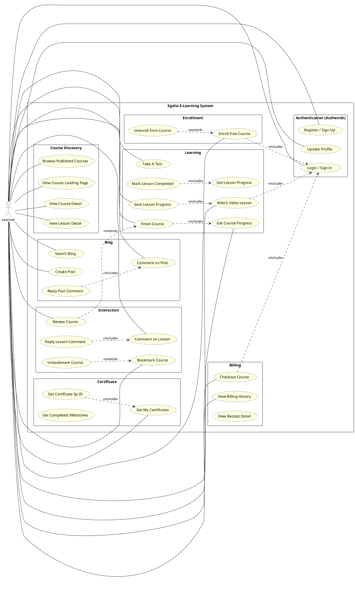

# Use Case Diagram - Learner

```plantuml
@startuml
left to right direction
skinparam packageStyle rectangle
skinparam usecase {
  BackgroundColor LightYellow
  BorderColor DarkSlateGray
}

actor "Learner" as L

rectangle "Egolia E-Learning System" {

  package "Authentication (Authentik)" {
    usecase "Login / Sign In" as UC_LOGIN
    usecase "Register / Sign Up" as UC_REG
    usecase "Update Profile" as UC_PROFILE
  }

  package "Course Discovery" {
    usecase "Browse Published Courses" as UC_BROWSE
    usecase "View Course Landing Page" as UC_LANDING
    usecase "View Course Detail" as UC_DETAIL
    usecase "View Lesson Detail" as UC_LESSON
  }

  package "Enrollment" {
    usecase "Enroll Free Course" as UC_ENROLL
    usecase "Unenroll from Course" as UC_UNENROLL
  }

  package "Learning" {
    usecase "Watch Video Lesson" as UC_WATCH
    usecase "Take A Test" as UC_TEST
    usecase "Save Lesson Progress" as UC_SAVE_PROG
    usecase "Get Lesson Progress" as UC_GET_PROG
    usecase "Mark Lesson Completed" as UC_MARK
    usecase "Get Course Progress" as UC_COURSE_PROG
    usecase "Finish Course" as UC_FINISH
  }

  package "Interaction" {
    usecase "Comment on Lesson" as UC_COMMENT
    usecase "Reply Lesson Comment" as UC_REPLY
    usecase "Review Course" as UC_REVIEW
    usecase "Bookmark Course" as UC_BOOKMARK
    usecase "Unbookmark Course" as UC_UNBOOKMARK
  }

  package "Certificate" {
    usecase "Get My Certificates" as UC_CERTS
    usecase "Get Certificate by ID" as UC_CERT
    usecase "Get Completed Milestones" as UC_MILESTONES
  }

  package "Billing" {
    usecase "Checkout Course" as UC_CHECKOUT
    usecase "View Billing History" as UC_BILLING
    usecase "View Receipt Detail" as UC_RECEIPT
  }

  package "Blog" {
    usecase "Search Blog" as UC_SEARCH_BLOG
    usecase "Create Post" as UC_CREATE_POST
    usecase "Comment on Post" as UC_COMMENT_POST
    usecase "Reply Post Comment" as UC_REPLY_POST
  }

  ' === Include ===
  UC_WATCH ..> UC_LOGIN : <<include>>
  UC_ENROLL ..> UC_LOGIN : <<include>>
  UC_CHECKOUT ..> UC_LOGIN : <<include>>
  UC_SAVE_PROG ..> UC_WATCH : <<include>>
  UC_MARK ..> UC_GET_PROG : <<include>>
  UC_FINISH ..> UC_COURSE_PROG : <<include>>
  UC_CERT ..> UC_CERTS : <<include>>
  UC_REPLY ..> UC_COMMENT : <<include>>
  UC_REPLY_POST ..> UC_COMMENT_POST : <<include>>

  ' === Extend ===
  UC_UNENROLL ..> UC_ENROLL : <<extend>>
  UC_REVIEW ..> UC_FINISH : <<extend>>
  UC_UNBOOKMARK ..> UC_BOOKMARK : <<extend>>
}

L -- UC_LOGIN
L -- UC_REG
L -- UC_PROFILE
L -- UC_BROWSE
L -- UC_LANDING
L -- UC_DETAIL
L -- UC_LESSON
L -- UC_ENROLL
L -- UC_WATCH
L -- UC_TEST
L -- UC_SAVE_PROG
L -- UC_COURSE_PROG
L -- UC_FINISH
L -- UC_COMMENT
L -- UC_REVIEW
L -- UC_BOOKMARK
L -- UC_CERTS
L -- UC_CHECKOUT
L -- UC_BILLING
L -- UC_SEARCH_BLOG
L -- UC_CREATE_POST
L -- UC_COMMENT_POST

@enduml
```

<!-- diagram id="use-case-egolia-learner" -->
