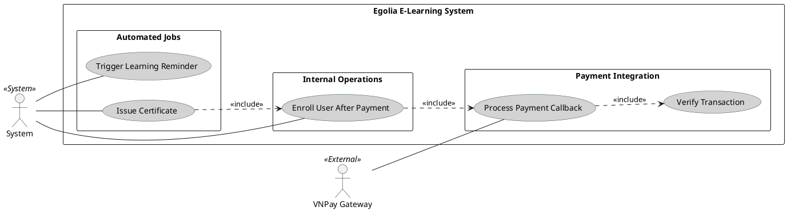

# Use Case Diagram - System

```plantuml
@startuml
left to right direction
skinparam packageStyle rectangle
skinparam usecase {
  BackgroundColor LightGray
  BorderColor DarkSlateGray
}

actor "System" as S <<System>>
actor "VNPay Gateway" as VN <<External>>

rectangle "Egolia E-Learning System" {

  package "Automated Jobs" {
    usecase "Trigger Learning Reminder" as UC_REMINDER
    usecase "Issue Certificate" as UC_CERT
  }

  package "Internal Operations" {
    usecase "Enroll User After Payment" as UC_ENROLL_USER
  }

  package "Payment Integration" {
    usecase "Process Payment Callback" as UC_CALLBACK
    usecase "Verify Transaction" as UC_VERIFY
  }

  ' === Include ===
  UC_CERT ..> UC_ENROLL_USER : <<include>>
  UC_CALLBACK ..> UC_VERIFY : <<include>>
  UC_ENROLL_USER ..> UC_CALLBACK : <<include>>
}

S -- UC_REMINDER
S -- UC_CERT
S -- UC_ENROLL_USER

VN -- UC_CALLBACK

@enduml
```

<!-- diagram id="use-case-egolia-system" -->
