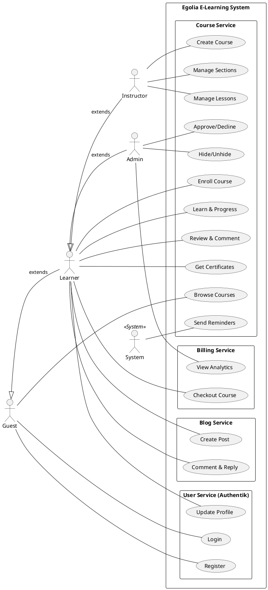

# Use Case - User (Actor Hierarchy)

## User và Hệ thống

```plantuml
@startuml
left to right direction
skinparam packageStyle rectangle

actor "Guest" as G
actor "Learner" as L
actor "Instructor" as I
actor "Admin" as A
actor "System" as S <<System>>

G <|-- L : extends
L <|-- I : extends
L <|-- A : extends

rectangle "Egolia E-Learning System" {

  package "User Service (Authentik)" {
    usecase "Login" as UC_LOGIN
    usecase "Register" as UC_REG
    usecase "Update Profile" as UC_PROFILE
  }

  package "Course Service" {
    usecase "Browse Courses" as UC_BROWSE
    usecase "Create Course" as UC_CREATE
    usecase "Manage Sections" as UC_SECTION
    usecase "Manage Lessons" as UC_LESSON
    usecase "Enroll Course" as UC_ENROLL
    usecase "Learn & Progress" as UC_LEARN
    usecase "Review & Comment" as UC_INTERACT
    usecase "Get Certificates" as UC_CERT
    usecase "Approve/Decline" as UC_APPROVE
    usecase "Hide/Unhide" as UC_HIDE
    usecase "Send Reminders" as UC_REMIND
  }

  package "Billing Service" {
    usecase "Checkout Course" as UC_PAY
    usecase "View Analytics" as UC_ANALYTICS
  }

  package "Blog Service" {
    usecase "Create Post" as UC_POST
    usecase "Comment & Reply" as UC_COMMENT
  }
}

' === Guest ===
G -- UC_LOGIN
G -- UC_REG
G -- UC_BROWSE

' === Learner (inherits Guest) ===
L -- UC_PROFILE
L -- UC_ENROLL
L -- UC_LEARN
L -- UC_INTERACT
L -- UC_CERT
L -- UC_PAY
L -- UC_POST
L -- UC_COMMENT

' === Instructor (inherits Learner) ===
I -- UC_CREATE
I -- UC_SECTION
I -- UC_LESSON

' === Admin (inherits Learner) ===
A -- UC_APPROVE
A -- UC_HIDE
A -- UC_ANALYTICS

' === System ===
S -- UC_REMIND

@enduml
```

<!-- diagram id="use-case-egolia-user" -->
